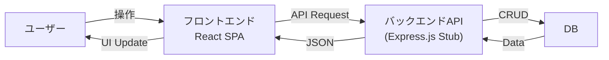

## 2. サンプルアプリ概要

- 2.1 今回開発する「商品管理アプリ」
- 2.2 全体アーキテクチャ
- 2.3 技術スタック
- 2.4 まとめ

---

### 2.1 今回開発する「商品管理アプリ」

本講座では、**商品管理アプリ** の開発を通じて、基本的な画面開発のパターンを抑えます。

このアプリは以下の **3つの画面** をメインに構成されており、これらを通してデータの取得、更新、新規作成、削除といった一連の流れを実装していきます。

1.  **商品一覧画面**: データの取得と表示
2.  **商品追加画面**: データの新規作成
3.  **商品詳細画面**: データの取得と更新・削除

これらを作ることで、実務で必要となる基本的なフロントエンド処理をカバーできるようになります。

---

### 2.2 サンプルアプリの全体アーキテクチャ

本来はバックエンド経由でデータベースから商品データを取得したり登録したりする構成を想定していますが、本講座では **Express.js 製のスタブ（スタブサーバー）** を使用して代用します。

スタブサーバーを使うことで、バックエンドの複雑な実装を気にせず、フロントエンドのロジック（データ取得や状態管理）に集中して学習を進めます。

---

### 2.3 技術スタック

「開発効率」と「モダンな開発体験」を重視して、以下の技術を利用します。

| カテゴリ | ライブラリ | 選定理由 |
|---|---|---|
| **フレームワーク** | **React Router v7** | 最新のFrameworkモードを使用。 |
| **データ取得** | **TanStack Query v5** | データ取得とキャッシュ管理のデファクトスタンダード。 |
| **状態管理** | **Zustand** | シンプルなグローバルステート管理。 |
| **UIライブラリ** | **MUI (Material UI) v7** | 素早くきれいな管理画面を作るため。 |
| **入力フォーム** | **React Hook Form** | パフォーマンスの良いフォーム管理。 |
| **バリデーション** | **Zod** | TypeScriptと相性の良いバリデーションライブラリ。 |
| **バックエンド** | **Express.js** | APIスタブサーバーとして使用。 |

#### 開発環境・ツール

| カテゴリ | ツール | 備考 |
|---|---|---|
| **ランタイム** | **Node.js** | v20以上推奨。 |
| **パッケージ管理** | **pnpm** | 高速でディスク効率が良い。 |
| **言語** | **TypeScript** | 型安全性のため必須。 |
| **ビルドツール** | **Vite** | 高速な開発サーバーとビルド。 |

---

この章では、これから作るアプリの概要と技術スタックを紹介しました。

次章からは、実際に開発環境のセットアップ手順やソースコードを見ていきましょう。