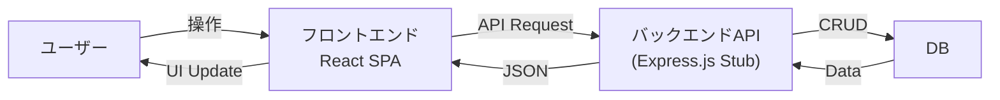

## 2. サンプルアプリ概要

- 2.1 今回開発する「商品管理アプリ」
- 2.2 全体アーキテクチャ
- 2.3 技術スタック
- 2.4 まとめ

---

### 2.1 今回開発する「商品管理アプリ」

本講座では、**商品管理アプリ** の開発を通じて、基本的な画面開発のパターンを抑えます。

このアプリは以下の **3つの画面** をメインに構成されており、これらを通してデータの取得、更新、新規作成、削除といった一連の流れを実装していきます。

1.  **商品一覧画面**: データの取得と表示
2.  **商品追加画面**: データの新規作成
3.  **商品詳細画面**: データの取得と更新・削除

これらを作ることで、実務で必要となる基本的なフロントエンド処理をカバーできるようになります。

---

### 2.2 サンプルアプリの全体アーキテクチャ

本来はバックエンド経由でデータベースから商品データを取得したり登録したりする構成を想定していますが、本講座では **Express.js 製のスタブ（スタブサーバー）** を使用して代用します。

スタブサーバーを使うことで、バックエンドの複雑な実装を気にせず、フロントエンドのロジック（データ取得や状態管理）に集中して学習を進めます。

---

### 2.3 技術スタック

「開発効率」と「モダンな開発体験」を重視して、以下の技術を利用します。各ライブラリの詳細やメリットは後続の章で確認していきます。

| カテゴリ | ライブラリ | 選定理由 |
|---|---|---|
| **フレームワーク** | **React Router v7** | **Frameworkモード**を採用します。コンポーネントと「データ取得」「データ送信」のロジックを分離しやすいなどのメリットがあります。 |
| **データ取得** | **TanStack Query v5** | 「ロード中」「エラー」「キャッシュ」といった複雑な非同期処理の状態管理をシンプルに実装することができます。 |
| **状態管理** | **Zustand** | アプリ全体で共有したいデータを、Reduxよりも圧倒的に少ない記述量で管理できます。 |
| **UIライブラリ** | **MUI (Material UI) v7** | 整ったデザインのUIパーツが豊富に用意されており、CSSを書く時間を節約して機能実装に集中できます。 |
| **入力フォーム** | **React Hook Form** | 入力項目が多いフォームでも、不要な再レンダリングを抑えて高速に動作します。 |
| **バリデーション** | **Zod** | バリデーションルールとTypeScriptの型定義をセットで記述でき、型とルールの二重管理を防げます。 |

#### 開発環境・ツール

| カテゴリ | ツール | 選定理由 |
|---|---|---|
| **ランタイム** | **Node.js** | JavaScriptの実行環境です。最新の機能と安定性を確保するため、LTS（長期サポート）版であるv20以上を利用します。 |
| **パッケージ管理** | **pnpm** | npm互換のパッケージマネージャーです。インストールが非常に高速で、ディスク容量も節約できるため採用します。 |
| **ビルドツール** | **Vite** | 次世代のフロントエンドビルドツールです。開発サーバーの起動や更新が非常に速く、快適な開発体験が得られます。 |
| **モックサーバ** | **Express.js** | フロントエンドと同じ言語で手軽にAPIサーバーを用意できるため、今回はスタブ（モック）として利用します。 |
