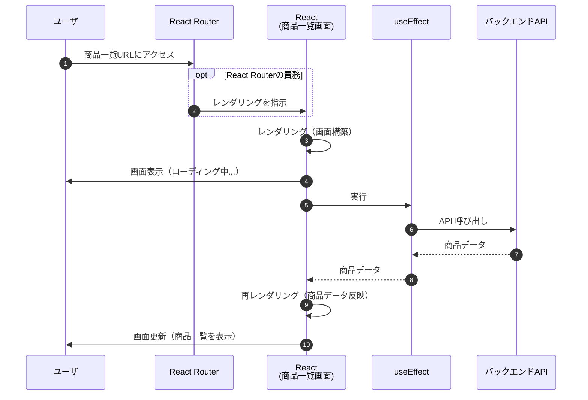
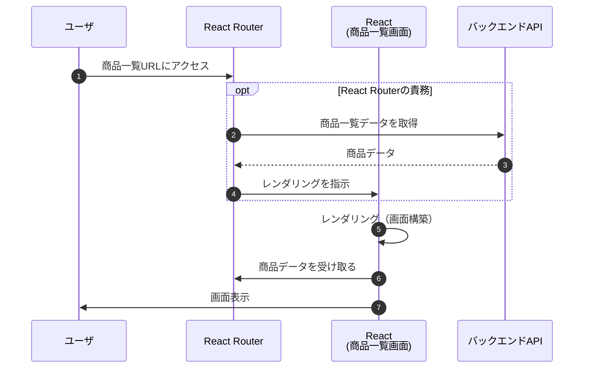
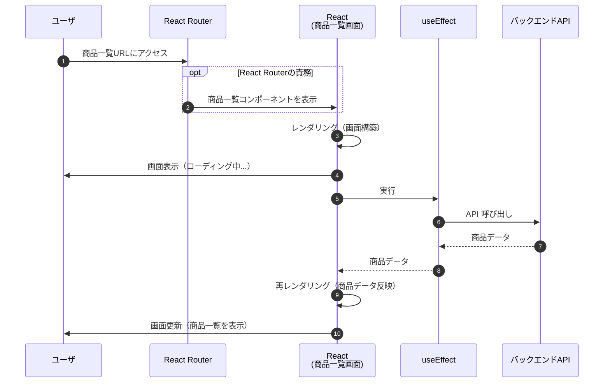
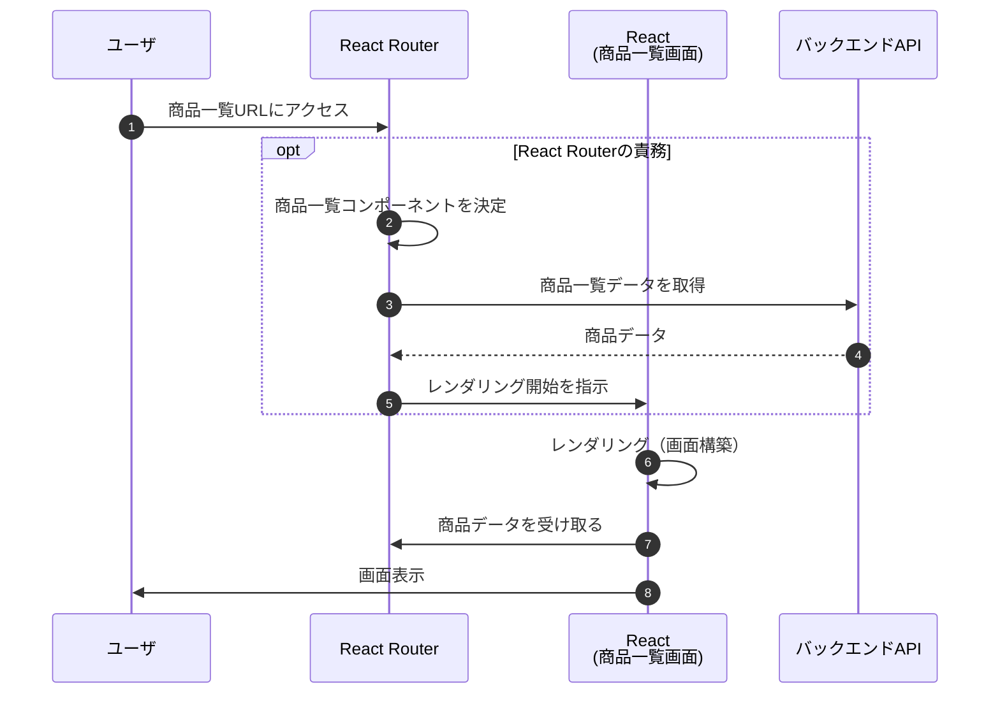
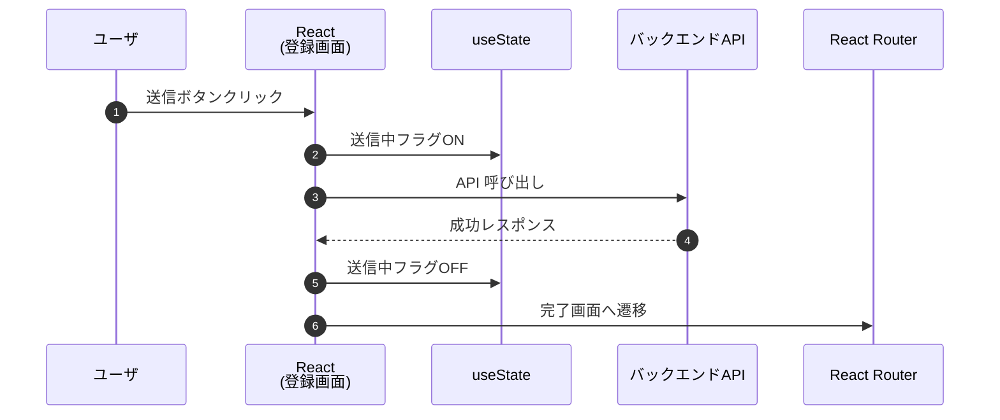
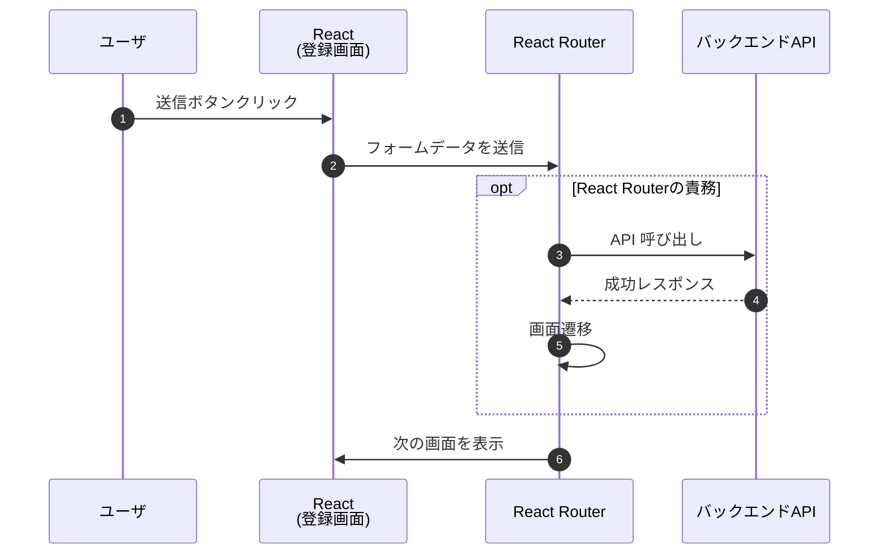
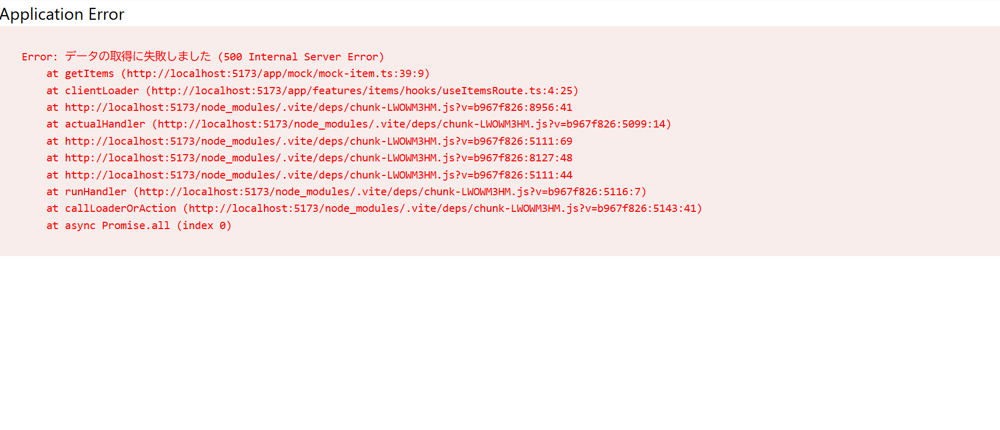

## 4. React Router

### 4.1 React Router Frameworkモードとは

React Router v7 の Framework モードは、従来の「URLに対応する画面を表示するルーティング機能」に加え、「画面に必要なデータを取得する機能」や「フォーム送信機能」などが統合された、新しい開発モデルです。

これまでコンポーネントの中に書いていた「データ取得」などを React Router が実行してくれるため、コンポーネントのソースコードを大幅にシンプルにできます。

その違いを直感的に理解するために、「商品一覧ページ」を表示する流れで比較してみましょう。

#### 4.1.1 従来のReact Router

まずは、従来の React Router (Declarative モード) を利用した場合のフローです。



このシーケンスでは、**「商品一覧画面」が表示された後に、`useEffect` が動いて「商品データ」を取りに行っている** ことがわかります。
従来の React Router の仕事は「URL に合ったコンポーネントを出すこと」までで、その後のデータ取得は商品一覧画面のコンポーネントの中で実行する必要があります。

そのため、下記のような課題が発生することがありました。
- データ取得とUI（データ表示や状態管理）をコンポーネントの中で実装することになり、コードが複雑になる。
- 類似した処理でも、画面や開発者によって実装方法がバラツキやすい


#### 4.1.2 React Router Frameworkモード

次に、Framework モードを利用した場合のフローです。



このシーケンスでは、**「商品一覧画面を表示する前に、Router が裏側で商品データを取得している」** 点が最大の特徴です。

これまでは「画面が表示されてからデータを取る（その間はローディング表示）」のが当たり前でしたが、Framework モードでは **「データが揃ってから画面を表示する」** という動きが可能になります。

このようにデータ取得をReact Routerに実行させることで下記のような強力なメリットがあります。

- **データ取得ロジックをコンポーネントから分離させ、変更に強いシンプルなコード構成にできる**
- **データ取得とレンダリングなどのタイミングを統一できる**
- **複数人で複数画面を開発する場合、処理フローやコードのバラツキを抑えられる**


#### 4.1.3 Frameworkモードの機能

ここまで商品情報一覧の表示を例にFrameworkモードのメリットを紹介しましたが、Frameworkモードには、このようにReact開発を助ける機能が多く存在しています。

この講座では重要な一部機能にのみ紹介しますが、どれも非常に便利な機能です。

| 機能名 | 概要 | 従来のReactでの実装例 |
|---|---|---|
| データ取得（loader / clientLoader） | 画面表示前に、そのURLに必要なデータ取得を実行する | useEffect + useState で画面表示後に取得。ローディング用の state を自前管理 |
| ユーザー操作による処理（action / clientAction） | 登録・更新・削除など、ユーザー操作に伴う処理をルーティング単位で定義 | onSubmit 内で API 呼び出し、成功/失敗判定、エラー state、遷移処理をすべて自前実装 |
| エラー表示（ErrorBoundary） | データ取得・処理失敗時のエラー表示を共通化 | try/catch + error state を各画面で個別実装 |
| meta 情報の設定 | 画面ごとの title / meta description を定義 | useEffect + document.title の直接操作、または head 操作用ライブラリ |
| 再検証・再取得の制御 | いつデータを再取得するかを Router が判断 | 再取得用の関数を自作し、再実行タイミングを手動管理 |
| リダイレクト制御 | 条件に応じた画面遷移を Router 側で定義 | useNavigate を使って処理成功後・失敗後に手動遷移 |

これらの機能を利用することで、下記のような非常に強力なメリットがあります。

- **データ取得や送信などのロジックをコンポーネントから分離させ、変更に強いシンプルなコード構成にできる**
- **データ取得や送信、レンダリングなどのタイミングを統一できる**
- **複数人で複数画面を開発する場合、処理フローやコードのバラツキを抑えられる**


現時点ではまだ具体的なイメージが湧きづらい部分もあるかと思いますが、以降の章で実際のコードを書きながら、React Router Framework モードがいかに開発を楽にしてくれるのかを体感していきましょう。


### 4.2 ルーティング

この章では下記ブランチを利用します。  
`ch4-2/routing`

#### 4.2.1 ルーティングとは

ルーティングとは、**ブラウザの URL と、表示する画面（コンポーネント）を結びつける仕組み**のことです。  
Web アプリでは、URL が変わることで「どの画面を表示するか」「どの処理を実行するか」が決まります。

たとえば次のように、URL ごとに表示される画面が対応づけられています。
- `https://{app domain}/items` にアクセスすると、商品一覧画面を表示する
- `https://{app domain}/reports` にアクセスすると、レポート画面を表示する

React Router は、この **URL と画面の対応関係を管理する役割**を担っています。

#### 4.2.2 Frameworkモードのルートページ

従来の React + React Router の構成では、`index.html` と `main.tsx` を起点として、`App.tsx` にページコンポーネントを表示する形が一般的でした。

この構成では、
- HTML の枠組みは `index.html`
- ルーティングは `BrowserRouter`
- 共通レイアウトやページ切り替えは `App.tsx`

といった役割分担になっていました。

```html
<!-- index.html -->
<!doctype html>
<html lang="ja">
  <head>
    <meta charset="UTF-8" />
    <meta name="viewport" content="width=device-width, initial-scale=1.0" />
    <title>Sample App</title>
  </head>
  <body>
    <div id="root"></div>
    <script type="module" src="/src/main.tsx"></script>
  </body>
</html>
```
```ts
// main.tsx
import React from "react";
import ReactDOM from "react-dom/client";
import { BrowserRouter } from "react-router-dom";
import App from "./App";

ReactDOM.createRoot(document.getElementById("root")!).render(
  <React.StrictMode>
    <BrowserRouter>
      <App />
    </BrowserRouter>
  </React.StrictMode>
);
```
```ts
// App.tsx
import { Routes, Route } from "react-router-dom";
import ItemsPage from "./pages/ItemsPage";
import ReportsPage from "./pages/ReportsPage";

export default function App() {
  return (
    <>
      <header>ヘッダー</header>
      <Routes>
        <Route path="/items" element={<ItemsPage />} />
        <Route path="/reports" element={<ReportsPage />} />
      </Routes>
      <footer>フッター</footer>
    </>
  );
}
```

---

React Router Framework モードでは、この構成が変わります。**`root.tsx` がアプリ全体のルートページ兼、共通レイアウトの役割を担う**ようになります。

`root.tsx` に定義されたレイアウトの中で、`Outlet` が **URL に対応するページコンポーネントの差し込み口**になります。

その結果、
- HTML 構造
- 共通レイアウト
- ページ切り替えの起点

を React Router がまとめて管理する構成になります。
```ts
// root.tsx
export function Layout({ children }: { children: React.ReactNode }) {
  return (
    <html lang="en">
      <head>
        <meta charSet="utf-8" />
        <meta name="viewport" content="width=device-width, initial-scale=1" />
        <Meta />
        <Links />
      </head>
      <body>
        {children}
        <ScrollRestoration />
        <Scripts />
      </body>
    </html>
  );
}

export default function App() {
  return <Outlet />;  //ここにページコンポーネントを表示
}
```

#### 4.2.3 Frameworkモードのルーティングの設定方法

Framework モードでは、ルーティングの定義方法はいくつかありますが、ここでは **代表的な 2 つの方法** を紹介します。

**1.URL とページを 明示的に定義する方法**

`routes.ts` で、**URL と対応するページコンポーネントを手動で紐づける方法**です。

```ts
import { type RouteConfig, route, index } from "@react-router/dev/routes";

export default [
  index("./routes/_index.tsx"),
  route("items", "./routes/items._index.tsx"),
  route("items/:id", "./routes/items.$id.tsx"),
  route("reports", "./routes/reports._index.tsx"),
  route("error", "./routes/error.tsx"),
] satisfies RouteConfig;
```
この方法の特徴は次の通りです。
- URL 構造がコード上で明示的に分かる
- ディレクトリ構成やファイル名に縛られない
- 複雑なルーティング構成でも柔軟に定義できる

一方で、ページ数が増えると定義量が多くなり、管理が煩雑になりやすいという側面もあります。

**2.flatRoutes を使い、ファイル名ベースで自動的に紐づける方法**

もう 1 つは、flatRoutes を利用してファイル名をそのまま URL 構造として扱う方法です。
この機能を利用するには、`@react-router/fs-routes` パッケージが必要です。

```bash
pnpm add -D @react-router/fs-routes
```

```ts
import { type RouteConfig } from "@react-router/dev/routes";
import { flatRoutes } from "@react-router/fs-routes";

export default flatRoutes() satisfies RouteConfig;
```

この場合、routes ディレクトリ内のファイル名が自動的に URL として解釈されます。
- items._index.tsx → /items
- items.$id.tsx → /items/:id
- reports._index.tsx → /reports

といった対応関係が、ファイル名から自動で設定されます。

この講座で利用するサンプルアプリでは、flatRoutes を使ったファイル名ベースのルーティングを採用します。

#### 4.2.4 flatRouteによる動作確認

ここでは、設定をほとんど書かなくてもファイル名に応じて URL とページが自動的に紐づけられていることを確認します。

サンプルアプリには、すでに以下のファイルが用意されています。

- `app/routes/items._index.tsx`
- `app/routes/items.$id.tsx`
- `app/routes/items.new._index.tsx`

下記のURLにアクセスすると、それぞれのコンポーネントが表示されることが確認できます。

- `/items` → `ItemsPage` が表示される
- `/items/123` → `ItemDetailPage` が表示される
- `/items/new` → `ItemCreatePage` が表示される

このように、Framework モードでは、ファイル名によってルーティングを自動的に設定することができます。

#### 4.2.5 まとめ

この章では、Framework モードにおけるルーティングの考え方と、URL とページコンポーネントを紐づける方法について解説しました。

まず、ルーティングとは**URL と表示する画面を結びつける仕組み**であり、React Router がその対応関係を管理していることを確認しました。

Framework モードでは、`root.tsx` がアプリ全体の起点となり、HTML 構造や共通レイアウト、ページ切り替えをReact Router がまとめて管理する構成になります。

また、ルーティングの定義方法として、
- URL とページを明示的に定義する方法
- `flatRoutes` を使い、ファイル名ベースで自動的に紐づける方法

の 2 つを紹介しました。

本講座のサンプルアプリのように、ページ数がそこまで多くなく、ルーティング構造をシンプルに保ちたい場合は、`flatRoutes` を使ったファイル名ベースのルーティングが扱いやすい選択肢になります。

一方で、URL 構造が複雑なアプリや、ルーティング単位で明確に整理したい大規模アプリでは、URL とページを明示的に定義する方法が適しているケースもあります。

アプリの特性に応じて適切な方法を選択してください。

次の章で画面遷移の方法を確認し、その後ここで定義したルートの中で**どのようにデータを取得し、画面を表示していくのか**を実際のコードを見ながら確認していきます。


### 4.3 画面遷移

React Router を利用した画面遷移について解説します。

#### 4.3.1 SPAにおける画面遷移の仕組み

通常の Web サイト（`<a>` タグや `href` 属性）と、React Router（SPA）での画面遷移には、大きな違いがあります。

*   **`<a>` タグ / `href` 属性**:  
    サーバーから HTML や JavaScript ファイル一式を**丸ごと再取得**します。そのため、画面が一瞬白くなり、読み込みに時間がかかります。  
    またブラウザで動作するアプリが初期化され、状態管理が初期化されてしまいます。

*   **React Router (`<Link>`, `useNavigate`)**:  
    JavaScript ファイルの再取得は行わず、**ブラウザ上で表示するコンポーネントだけを切り替えます**。
    これにより、画面が白くなることなく、アプリのようなスムーズな画面遷移（クライアントサイドルーティング）が実現できます。

#### 4.3.2 実装方法

React Router で画面遷移を行うための主要な 3 つの方法を紹介します。

**1. 基本的な遷移 (`<Link>`)**

ユーザーがクリックして画面移動する箇所（メニューや一覧からの詳細遷移など）では、`<Link>` コンポーネントを使います。
HTML の `<a>` タグと同じ感覚で利用できます。

```tsx
import { Link } from "react-router";

export function Menu() {
  return (
    <nav>
      {/* to 属性に遷移先のパスを指定 */}
      <Link to="/items">商品一覧へ</Link>
      <Link to="/reports">レポートへ</Link>
    </nav>
  );
}
```

**2. 現在地がわかる遷移 (`<NavLink>`)**

ヘッダーやサイドメニューなど、「今どのページを開いているか」をスタイルで表現したい場合は、`<NavLink>` を使います。
「現在表示しているページとリンク先が一致しているかどうか」を自動で判定し、クラスを付与することができます。

```tsx
import { NavLink } from "react-router";

// 今いるページなら "active" クラスが付与される
<NavLink
  to="/items"
  className={({ isActive }) => isActive ? "active-link" : ""}
>
  商品一覧
</NavLink>
```

**3. プログラムによる遷移 (`useNavigate`)**

「ボタンを押して処理が終わったら移動する」といった、ユーザーのクリックではなく、プログラムの処理として画面を切り替えたい場合は、`useNavigate` フックを使います。

```tsx
import { useNavigate } from "react-router";

export function LoginPage() {
  const navigate = useNavigate();

  const handleLogin = async () => {
    await login();
    // 処理完了後にトップページへ遷移
    navigate("/");
  };

  return (
    <button onClick={handleLogin}>ログイン</button>
  );
}
```


### 4.4 clientLoader

画面を表示するとき、バックエンド（API）からデータを取得して表示することは非常に多いです。
例えば「商品一覧ページ」を開いたら、すぐに商品リストのデータをAPIから取ってくる、といった動きです。

この章では下記のブランチを利用します。  
`ch4-4/clientLoader`

#### 4.4.1 従来の「useEffect」を使ったデータ取得の課題

従来の React Router (Declarative モード) を利用した場合、**「商品一覧画面」が表示された後に、`useEffect` が動いて「商品データ」を取りに行っている** ことがわかります。



従来の React Router の仕事は「URL に合ったコンポーネントを出すこと」までで、その後のデータ取得は商品一覧画面のコンポーネントの中で実行する必要があります。

そのため、下記のような課題が発生することがありました。
- データ取得とUI（データ表示や状態管理）をコンポーネントの中で実装することになり、コードが複雑になる。
- 類似した処理でも、画面や開発者によって実装方法がバラツキやすい


#### 4.4.2 clientLoader なら「データ取得を実行してから」表示できる

Framework モードの `clientLoader` を使うと、**「商品一覧画面を表示する前に、Router が裏側で商品データを取得している」** という動きに変わります。



これまでは「画面が表示されてからデータを取る（その間はローディング表示）」のが当たり前でしたが、Framework モードでは **「データが揃ってから画面を表示する」** という動きが可能になります。  
このようにデータ取得をReact Routerに実行させることで下記のような強力なメリットがあります。

- **データ取得ロジックをコンポーネントから分離させ、変更に強いシンプルなコード構成にできる**
- **データ取得とレンダリングなどのタイミングを統一できる**
- **複数人で複数画面を開発する場合、処理フローやコードのバラツキを抑えられる**


#### 4.4.3 コードで比較してみる

**従来の書き方（useEffect）**  
「データを取る処理」「ローディング管理」「エラー管理」が全部コンポーネントに入っています。

```ts
export default function ItemsPage() {
  // 1. 状態管理が面倒
  const [items, setItems] = useState<Item[]>([]);
  const [isLoading, setIsLoading] = useState(true);

  useEffect(() => {
    // 2. データ取得処理がコンポーネントに混ざる
    const fetchItems = async () => {
      const data = await getItems();
      setItems(data);
      setIsLoading(false);
    };
    fetchItems();
  }, []);

  // 3. データがない時の分岐が必要
  if (isLoading) return <div>Loading...</div>;

  return (
    <ul>
      {items.map((item) => (
        <li key={item.id}>{item.name}</li>
      ))}
    </ul>
  );
}
```

**Framework モードの書き方（clientLoader）**  
コンポーネントは「データを受け取って表示するだけ」になります。

```ts
// 1. データ取得はコンポーネントの外（Router）に追い出す
export const clientLoader = async () => {
  const items = await getItems();
  return { items };
};

export default function ItemsPage() {
  // 2. フックでデータを受け取るだけ
  const { items } = useLoaderData() as { items: Item[] };

  // 3. ローディング分岐もuseEffectも不要
  return (
    <ul>
      {items.map((item) => (
        <li key={item.id}>{item.name}</li>
      ))}
    </ul>
  );
}
```

比較してみると、`clientLoader` が「データの取得」を担当し、コンポーネントは「データの表示」に専念していることがわかります。
役割が明確に分かれたことで、コンポーネントのコードが劇的にシンプルになりました。

また、「データを取得してから画面を表示する」というフローがフレームワークによって強制されるため、開発者ごとの実装のバラつきがなくなります。
誰が書いても同じような構成になるため、コードの読みやすさが向上し、レビューや保守も容易になります。

このように、**シンプルで明確なコード** と **統一された処理フロー** が実現できることが、Framework モードを採用する大きな理由です。
結果として、バグが少なく、変更に強いアプリケーションをスピーディに開発できるようになります。


### 4.5 clientAction

`clientAction` は、**フォーム送信（登録・更新・削除）の処理を Router に任せる仕組み** です。
`clientLoader` が「データを取る」担当なら、`clientAction` は「データを送る」担当です。

この章では下記のブランチを利用します。  
`ch4-5/clientAction`

#### 4.5.1 従来のフォーム送信の課題

従来の React でフォーム送信を実装する場合、コンポーネント内で `onSubmit` イベントをハンドルし、API呼び出しや状態管理を行うのが一般的でした。



この方法には、次のような「課題」があります。

1.  **状態管理（State）が大量に必要になる**
    *   入力値、送信中フラグ、成功フラグなどをすべて `useState` で管理する必要があります。
2.  **送信ロジックがコンポーネントの中に書かれる**
    *   「UI実装」と「通信処理」が混ざり合い、コンポーネントが肥大化します。

#### 4.5.2 clientAction なら「フォーム」と「処理」を分離できる

Framework モードの `clientAction` を使うと、**「コンポーネントはフォームを表示するだけ、処理は Router が裏側で実行する」** という形に変わります。



このようにデータ送信をReact Routerが実行することで下記のようなメリットがあります。

- **送信ロジックをコンポーネントから分離させ、変更に強いシンプルなコード構成にできる**
- **送信処理と画面遷移などのタイミングを統一できる**
- **複数人で複数画面を開発する場合、処理フローやコードのバラツキを抑えられる**


#### 4.5.3 コードで比較してみる

**従来の書き方**  
コンポーネント（ItemCreatePage）の中に、送信処理、状態管理、分岐が入り乱れています。

```ts
export default function ItemCreatePage() {
  const navigate = useNavigate();
  // 1. state管理が大量に必要
  const [name, setName] = useState("");
  const [price, setPrice] = useState(0);
  const [error, setError] = useState<string | null>(null);

  const handleSubmit = async () => {
    try {
      // 2. 送信処理をコンポーネントの中に書く
      await createItem({ name, price });
      navigate("/items");
    } catch (e) {
      setError("失敗しました");
    }
  };

  return (
    <div>
      {error && <p>{error}</p>}
      <input value={name} onChange={(e) => setName(e.target.value)} />
      <input value={price} onChange={(e) => setPrice(Number(e.target.value))} />
      <button onClick={handleSubmit}>
        登録
      </button>
    </div>
  );
}
```

**Framework モードの書き方（clientAction）**  
コンポーネントは純粋なフォームだけになり、送信処理はclientActionに定義されています。

```ts
// 1. 送信処理はここに書く（コンポーネントの外）
export const clientAction = async ({ request }: ClientActionFunctionArgs) => {
  const formData = await request.formData();
  const name = formData.get("name");
  const price = formData.get("price");

  try {
    // 入力値は formData から取れるので state 不要
    await createItem({
      name: name as string,
      price: parseInt(price as string, 10)
    });
    return redirect("/items");
  } catch (e) {
    return { error: "失敗しました" };
  }
};

export default function ItemCreatePage() {
  const actionData = useActionData() as { error?: string };

  // 2. コンポーネントは「フォームの見た目」だけ
  return (
    <Form method="post">
      {actionData?.error && <p>{actionData.error}</p>}
      <input name="name" placeholder="商品名" />
      <input name="price" type="number" placeholder="価格" />
      <button type="submit">登録</button>
    </Form>
  );
}
```

比較してみると、`clientAction` が「データの送信」を担当し、コンポーネントは「フォームの表示」に専念していることがわかります。
役割が明確に分かれたことで、コンポーネントのコードが劇的にシンプルになりました。

また、「送信処理を行ってから画面遷移する」というフローがフレームワークによって強制されるため、開発者ごとの実装のバラつきがなくなります。
誰が書いても同じような構成になるため、コードの読みやすさが向上し、レビューや保守も容易になります。

このように、**シンプルで明確なコード** と **統一された処理フロー** が実現できることが、Framework モードを採用する大きな理由です。
結果として、バグが少なく、変更に強いアプリケーションをスピーディに開発できるようになります。


### 4.6 ErrorBoundary（エラーハンドリング）

この章では下記のブランチを利用します。  
`ch4-6/ErrorBoundary`

#### 4.6.1 共通のエラーハンドリング処理

React Router v7 の `ErrorBoundary` は、アプリケーション内で発生した予期せぬエラーを捕捉し、適切なエラー画面を表示するための仕組みです。  
コンポーネントやclientLoader/clientActionなどで例外（Error）がスローされると、個別にtry-catchされていない場合 `ErrorBoundary` がレンダリングされます。  
これにより、予期せぬエラーが発生した場合でも、アプリケーション全体がクラッシュすることなく、ユーザーフレンドリーなエラー画面を表示できます。

もし `ErrorBoundary` を設定していない場合、開発モードでは以下のようなスタックトレースが表示され、ユーザーにとって非常に分かりにくい（かつ不安を与える）画面になる可能性があります。




もちろん、特定のボタン操作時だけ特別なメッセージを出したい場合など、**個別に `try-catch` してハンドリングすることも可能**です。  
しかし、`ErrorBoundary` を使うことで、**「予期せぬエラーの制御」や「共通のエラー表示」を各画面に書く必要がなくなります**。

#### 4.6.2 実装イメージ（root.tsx）

例えば、アプリ全体の親となる `root.tsx` に `ErrorBoundary` を定義しておけば、どこの画面でエラーが起きても、最終的にここでキャッチしてエラー画面を表示できます。  
また`useRouteError`によって発生したエラー情報を取得することができます。

```ts
// root.tsx
// アプリ全体でエラーが起きたら、自動的にこれが表示される
export function ErrorBoundary() {
  // 発生したエラーを取得
  const error = useRouteError();

  return (
    <div className="error-box">
      <h2>システムエラーが発生しました</h2>
      // 発生したエラーを表示
      <p>{error instanceof Error ? error.message : "予期せぬエラーです"}</p>
      <Link to="/"  style={{ color: "blue", textDecoration: "underline" }}>
        トップへ戻る
      </Link>
    </div>
  );
}
```

#### 4.6.3 ErrorBoundaryに任せるメリット

ErrorBoundary を活用することで、開発プロセスにおいて次のような大きなメリットが生まれます。

- **エラーハンドリングの実装漏れを防げる**  
  個別の画面でエラー処理を書き忘れても、親ルートでキャッチして共通のエラー画面を表示できるため、画面が真っ白になる事故を防げます。
- **各画面の実装がシンプルになる**  
  「エラーが起きたらどうするか」を各画面で考える必要がなくなり、正常系の処理の実装に集中できます。
- **共通のデザインで統一できる**  
  アプリ全体で統一されたエラー画面（「申し訳ありません、エラーが発生しました」など）を簡単に提供できます。

このように、**「基本的には ErrorBoundary に任せる」** という方針をとることで、個別の実装負担を減らしつつ、アプリ全体の品質を担保できるようになります。


#### 4.6.4 動作確認

実際にエラーが発生した際の挙動を、2つのパターンで比較確認してみましょう。

**1. ErrorBoundary で捕捉されるケース（clientLoader）**

商品一覧ページ（`ItemsPage`）のデータ取得処理でエラーが発生した場合です。
`try-catch` を書かないことで、エラーは Router まで伝播し、自動的に `ErrorBoundary` が表示されます。

```ts
// app/routes/items._index.tsx
export const clientLoader = async () => {
  // ここで API エラーが発生すると...
  const items = await getItems(); 
  return { items };
};
```

> **結果:** `root.tsx` の `ErrorBoundary` （「システムエラーが発生しました」画面）が表示されます。  
> **ポイント:** 予期せぬエラーや、リカバリーできないエラーは、このように ErrorBoundary に任せるのが基本です。

<br>

**2. ErrorBoundary で捕捉されないケース（clientAction）**

商品登録ページ（`ItemCreatePage`）の登録処理でエラーが発生した場合です。
`try-catch` を使い、エラーをデータとして `return` しています。

```ts
// app/routes/items.new._index.tsx
export const clientAction = async ({ request }: ClientActionFunctionArgs) => {
  try {
    await createItem({ ... });
    return redirect("/items");
  } catch (e) {
    // エラーをキャッチして、データとして返す
    return { error: "失敗しました" };
  }
};
```

> **結果:** `ErrorBoundary` は表示されず、コンポーネント側で「失敗しました」というメッセージを表示します。   
> **ポイント:** ユーザーに入力ミスを伝えたり、再試行を促したりしたい場合は、個別にハンドリングします。


### 4.7 まとめ

ここまで紹介した機能を組み合わせると、React 開発は次のように変わります。

| 処理 | 従来 (React Router v6以前) | Framework モード (v7) |
|---|---|---|
| **データ取得** | `useEffect` で自前実装 | **`clientLoader`** に任せる |
| **フォーム送信** | `useState` + `onSubmit` で自前実装 | **`clientAction`** + `<Form>` に任せる |
| **エラー表示** | `try-catch` + `state` で分岐 | **`ErrorBoundary`** に任せる |

これにより、下記のような強力なメリットがあります。

- **ロジックやエラーハンドリングなどの共通処理をReact Router側で実行させることで、コンポーネントをシンプルにできる**
- **結果としてロジック、ハンドリングなどの処理を統一できる**
- **複数人で複数画面を開発する場合、処理フローやコードのバラツキを抑えられる**

その結果、**変更に強く、スピーディな開発ができる**ようになります。


次章からは、この強力な機能を実際に使いながら、サンプルアプリを構築していきます。