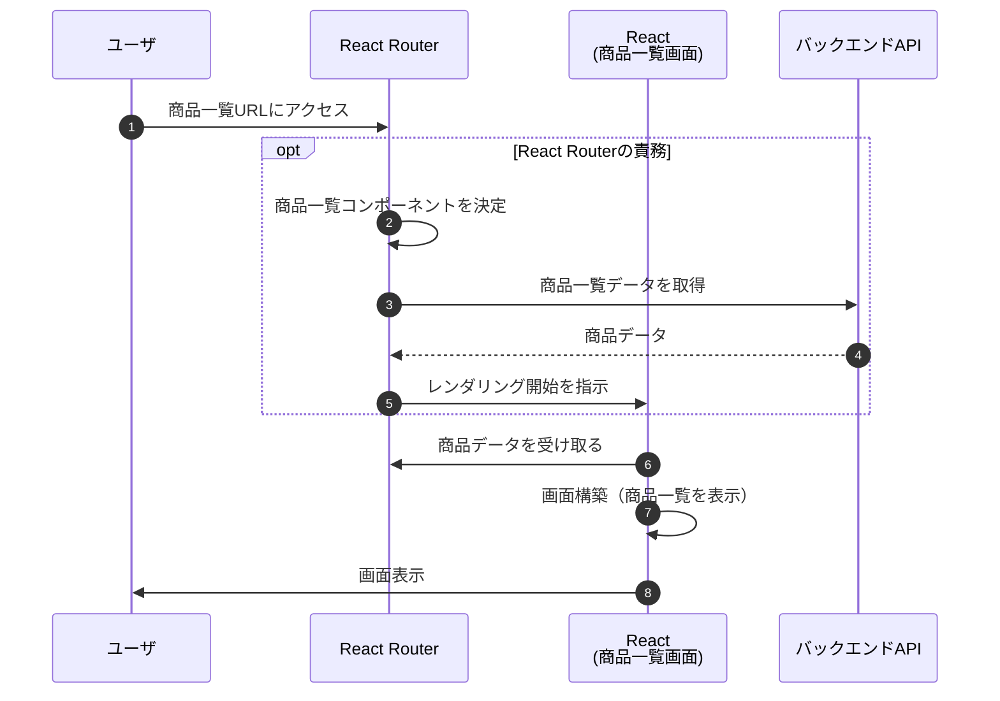

## 4. React Router

### 4.1 React Router Frameworkモードとは

React Router v7 の Framework モードは、従来の「URLに対応する画面を表示する機能」に加え、「画面に必要なデータを取得する機能」や「フォーム送信機能」などが統合された、新しい開発モデルです。

これまでコンポーネントの中に書いていた「データ取得」などを React Router が肩代わりしてくれるため、コンポーネントは「データを受け取って表示するだけ」のシンプルな形になります。

#### 4.1.1 従来のReact Router
その違いを直感的に理解するために、「商品一覧ページ」を表示する流れで比較してみましょう。

まずは、従来の React Router (Declarative モード) を利用した場合のフローです。


このシーケンスでは、**「商品一覧画面」が表示された後に、`useEffect` が動いて「商品データ」を取りに行っている** ことがわかります。
従来の React Router の仕事は「URL に合ったコンポーネントを出すこと」までで、その後のデータ取得は商品一覧画面のコンポーネントの中で実行する必要があります。

そのため、開発者は次のような処理をすべて自前で実装する必要がありました。
- 「まずはローディングを表示する」
- 「データが取れたら再レンダリングして商品一覧を表示する」

このように各画面で個別に実装していくと、
- 担当者によって書き方がバラバラになる
- 「データ取得中」「エラー時」「データあり」の分岐でコードが複雑になる

といった課題が生まれやすくなっていました。

#### 4.1.2 React Router Frameworkモード

次に、Framework モードを利用した場合のフローです。



このシーケンスでは、**「商品一覧画面を表示する前に、Router が裏側で商品データを取得している」** 点が最大の特徴です。

これまでは「画面が表示されてからデータを取る（その間はローディング表示）」のが当たり前でしたが、Framework モードでは **「データが揃ってから画面を表示する」** という動きが可能になります。

これにより、開発者は次のようなメリットを得られます。

1.  **「データがない状態」を考慮しなくていい**
    *   コンポーネントがレンダリングされる時点で、`items`（商品データ）は必ず存在します。
2.  **データ取得のロジックがコンポーネントから消える**
    *   「どうやってデータを取るか」は Router に任せ、コンポーネントは「データをどう表示するか」に集中できます。


#### 4.1.3 Frameworkモードの機能

ここまで画面遷移からデータ取得、画面表示までを例にFrameworkモードのメリットを紹介しましたが、Frameworkモードには、このようにReact開発を助ける機能が多く存在しています。

この講座では重要な一部機能にのみ紹介しますが、どれも非常に便利な機能です。

| 機能名 | 概要 | 従来のReactでの実装例 |
|---|---|---|
| データ取得（loader / clientLoader） | 画面表示前に、そのURLに必要なデータ取得を実行する | useEffect + useState で画面表示後に取得。ローディング用の state を自前管理 |
| ユーザー操作による処理（action / clientAction） | 登録・更新・削除など、ユーザー操作に伴う処理をルーティング単位で定義 | onSubmit 内で API 呼び出し、成功/失敗判定、エラー state、遷移処理をすべて自前実装 |
| フォーム送信（登録・更新・削除） | フォーム送信とサーバー処理を action として分離 | useState で入力管理、submit 時に API 呼び出し、結果に応じて setState / navigate |
| エラー表示（ErrorBoundary） | データ取得・処理失敗時のエラー表示を共通化 | try/catch + error state を各画面で個別実装 |
| meta 情報の設定 | 画面ごとの title / meta description を定義 | useEffect + document.title の直接操作、または head 操作用ライブラリ |
| 再検証・再取得の制御 | いつデータを再取得するかを Router が判断 | 再取得用の関数を自作し、再実行タイミングを手動管理 |
| リダイレクト制御 | 条件に応じた画面遷移を Router 側で定義 | useNavigate を使って処理成功後・失敗後に手動遷移 |

#### 4.1.4 まとめ

Framework モードは、従来の React 開発とは異なるライフサイクルを持つため、最初は**慣れが必要**かもしれません。

しかし、使いこなせるようになると、
- **データ取得やフォーム送信のロジックが統一される**
- **コンポーネントが「表示」に集中でき、コードが劇的にシンプルになる**
- **エラーハンドリングやローディング制御が標準化される**

といった、非常に強力なメリットを享受できます。

現時点ではまだ具体的なイメージが湧きづらい部分もあるかと思いますが、以降の章で実際のコードを書きながら、React Router Framework モードがいかに開発を楽にしてくれるのかを体感していきましょう。

---

### 4.2 ルーティング

この章では下記ブランチを利用します。  
`ch4-2/routing`

#### 4.2.1 ルーティングとは

ルーティングとは、**ブラウザの URL と、表示する画面（コンポーネント）を結びつける仕組み**のことです。  
Web アプリでは、URL が変わることで「どの画面を表示するか」「どの処理を実行するか」が決まります。

たとえば次のように、URL ごとに表示される画面が対応づけられています。
- `/items` にアクセスすると、商品一覧画面を表示する
- `/reports` にアクセスすると、レポート画面を表示する

React Router は、この **URL と画面の対応関係を管理する役割**を担っています。

#### 4.2.2 Frameworkモードのルートページ

従来の React + React Router の構成では、`index.html` と `main.tsx` を起点として、`App.tsx` にページコンポーネントを表示する形が一般的でした。

この構成では、
- HTML の枠組みは `index.html`
- ルーティングは `BrowserRouter`
- 共通レイアウトやページ切り替えは `App.tsx`

といった役割分担になっていました。

```html
<!-- index.html -->
<!doctype html>
<html lang="ja">
  <head>
    <meta charset="UTF-8" />
    <meta name="viewport" content="width=device-width, initial-scale=1.0" />
    <title>Sample App</title>
  </head>
  <body>
    <div id="root"></div>
    <script type="module" src="/src/main.tsx"></script>
  </body>
</html>
```
```ts
// main.tsx
import React from "react";
import ReactDOM from "react-dom/client";
import { BrowserRouter } from "react-router-dom";
import App from "./App";

ReactDOM.createRoot(document.getElementById("root")!).render(
  <React.StrictMode>
    <BrowserRouter>
      <App />
    </BrowserRouter>
  </React.StrictMode>
);
```
```ts
// App.tsx
import { Routes, Route } from "react-router-dom";
import ItemsPage from "./pages/ItemsPage";
import ReportsPage from "./pages/ReportsPage";

export default function App() {
  return (
    <>
      <header>ヘッダー</header>
      <Routes>
        <Route path="/items" element={<ItemsPage />} />
        <Route path="/reports" element={<ReportsPage />} />
      </Routes>
      <footer>フッター</footer>
    </>
  );
}
```

---

React Router Framework モードでは、この構成が変わります。**`root.tsx` がアプリ全体のルートページ兼、共通レイアウトの役割を担う**ようになります。

`root.tsx` に定義されたレイアウトの中で、`Outlet` が **URL に対応するページコンポーネントの差し込み口**になります。

その結果、
- HTML 構造
- 共通レイアウト
- ページ切り替えの起点

を React Router がまとめて管理する構成になります。
```ts
// root.tsx
export function Layout({ children }: { children: React.ReactNode }) {
  return (
    <html lang="en">
      <head>
        <meta charSet="utf-8" />
        <meta name="viewport" content="width=device-width, initial-scale=1" />
        <Meta />
        <Links />
      </head>
      <body>
        {children}
        <ScrollRestoration />
        <Scripts />
      </body>
    </html>
  );
}

export default function App() {
  return <Outlet />;  //ここにページコンポーネントを表示
}
```

#### 4.2.3 Frameworkモードのルーティングの設定方法

Framework モードでは、ルーティングの定義方法はいくつかありますが、ここでは **代表的な 2 つの方法** を紹介します。

**1.URL とページを 明示的に定義する方法**

`routes.ts` で、**URL と対応するページコンポーネントを手動で紐づける方法**です。

```ts
import { type RouteConfig, route, index } from "@react-router/dev/routes";

export default [
  index("./routes/_index.tsx"),
  route("items", "./routes/items._index.tsx"),
  route("items/:id", "./routes/items.$id.tsx"),
  route("reports", "./routes/reports._index.tsx"),
  route("error", "./routes/error.tsx"),
] satisfies RouteConfig;
```
この方法の特徴は次の通りです。
- URL 構造がコード上で明示的に分かる
- ディレクトリ構成やファイル名に縛られない
- 複雑なルーティング構成でも柔軟に定義できる

一方で、ページ数が増えると定義量が多くなり、管理が煩雑になりやすいという側面もあります。

**2.flatRoutes を使い、ファイル名ベースで自動的に紐づける方法**

もう 1 つは、flatRoutes を利用してファイル名をそのまま URL 構造として扱う方法です。
この機能を利用するには、`@react-router/fs-routes` パッケージが必要です。

```bash
pnpm add -D @react-router/fs-routes
```

```ts
import { type RouteConfig } from "@react-router/dev/routes";
import { flatRoutes } from "@react-router/fs-routes";

export default flatRoutes() satisfies RouteConfig;
```

この場合、routes ディレクトリ内のファイル名が自動的に URL として解釈されます。
- items._index.tsx → /items
- items.$id.tsx → /items/:id
- reports._index.tsx → /reports

といった対応関係が、ファイル名から自動で設定されます。

この講座で利用するサンプルアプリでは、flatRoutes を使ったファイル名ベースのルーティングを採用します。

#### 4.2.4 flatRouteによる動作確認

ここでは、設定をほとんど書かなくてもファイル名に応じて URL とページが自動的に紐づけられていることを確認します。

サンプルアプリ（該当ブランチ）には、すでに以下のファイルが用意されています。

- `app/routes/items._index.tsx`
- `app/routes/items.$id.tsx`
- `app/routes/items.new._index.tsx`

下記のURLにアクセスすると、それぞれのコンポーネントが表示されることが確認できます。

- `/items` → `ItemsPage` が表示される
- `/items/123` → `ItemDetailPage` が表示される
- `/items/new` → `ItemCreatePage` が表示される

このように、Framework モードでは、ファイル名によってルーティングを自動的に設定することができます。

#### 4.2.5 まとめ

この章では、Framework モードにおけるルーティングの考え方と、URL とページコンポーネントを紐づける方法について解説しました。

まず、ルーティングとは**URL と表示する画面を結びつける仕組み**であり、React Router がその対応関係を管理していることを確認しました。

Framework モードでは、`root.tsx` がアプリ全体の起点となり、HTML 構造や共通レイアウト、ページ切り替えをReact Router がまとめて管理する構成になります。

また、ルーティングの定義方法として、
- URL とページを明示的に定義する方法
- `flatRoutes` を使い、ファイル名ベースで自動的に紐づける方法

の 2 つを紹介しました。

本講座のサンプルアプリのように、ページ数がそこまで多くなく、ルーティング構造をシンプルに保ちたい場合は、`flatRoutes` を使ったファイル名ベースのルーティングが扱いやすい選択肢になります。

一方で、URL 構造が複雑なアプリや、ルーティング単位で明確に整理したい大規模アプリでは、URL とページを明示的に定義する方法が適しているケースもあります。

アプリの特性に応じて適切な方法を選択してください。

次の章で画面遷移の方法を確認し、その後ここで定義したルートの中で**どのようにデータを取得し、画面を表示していくのか**を実際のコードを見ながら確認していきます。

---

### 4.3 画面遷移（Link / useNavigate）

React Router で画面遷移を行うには、主に **`<Link>` コンポーネント** と **`useNavigate` フック** の 2 つの方法があります。

基本的には、HTML の `<a>` タグの代わりに **`<Link>` を使うのが推奨** されます。

#### 4.3.1 基本的な遷移（Link）

ユーザーがクリックして画面移動する箇所（メニューや一覧からの詳細遷移など）では、`<Link>` コンポーネントを使います。

通常の `<a>` タグと `<Link>` の違いは以下の通りです。

*   **`<a>` タグ**: SPAアプリ全体をサーバーから再取得するため、画面が一瞬白くなり、読み込みに時間がかかります。
*   **`<Link>`**: 必要な部分（コンポーネントやデータ）だけを読み込んで切り替えるため、**画面が白くならず、サクサクとスムーズに移動** できます。

```tsx
import { Link } from "react-router";

export function Menu() {
  return (
    <nav>
      {/* to 属性に遷移先のパスを指定 */}
      <Link to="/users">商品一覧へ</Link>
      <Link to="/reports">レポートへ</Link>
    </nav>
  );
}
```

#### 4.3.2 現在地がわかる遷移（NavLink）

ヘッダーやサイドメニューなど、「今どのページを開いているか」をユーザーに伝えたい場合は、`<NavLink>` を使います。

`<Link>` との違いは、**「現在表示しているページとリンク先が一致しているかどうか」** を自動で判定してくれる点です。
これを利用して、「選択中のメニューだけ色を変える」といったスタイル変更が簡単に実装できます。

```tsx
import { NavLink } from "react-router";

// 今いるページなら "active" クラスが付与される
<NavLink
  to="/users"
  className={({ isActive }) => isActive ? "active-link" : ""}
>
  商品一覧
</NavLink>
```

#### 4.3.3 プログラムによる遷移（useNavigate）

「ボタンを押して処理が終わったら移動する」といった、**ユーザーのクリックではなく、プログラムの処理として画面を切り替えたい場合** は、`useNavigate` フックを使います。

例えば、「ログインボタンを押す → ログイン処理を実行 → 成功したらトップページへ移動」といったケースで利用します。

```tsx
import { useNavigate } from "react-router";

export function LoginPage() {
  const navigate = useNavigate();

  const handleLogin = async () => {
    await login();
    // 処理完了後にトップページへ遷移
    navigate("/");
  };

  return (
    <button onClick={handleLogin}>ログイン</button>
  );
}
```

よく使われるパターン：
```ts
navigate("/items/123"); // 指定したパスへ遷移
navigate(-1);           // ブラウザの「戻る」と同じ動作
```

#### 4.3.3 使い分けのまとめ

| 方法 | 使う場面 |
|---|---|
| **`<Link>` / `<NavLink>`** | メニューやリストなど、**クリックして移動すること自体が目的** の場合 |
| **`useNavigate`** | ボタンクリック時の処理後やフォーム送信後など、**イベントや処理の結果として移動させる** 場合 |

> **Note:**  
> ボタンのクリックで画面遷移する場合でも、単にページを移動するだけなら `<Link>` コンポーネントをボタンのような見た目にして使うことが推奨されます（アクセシビリティやSEOの観点）。  
> `useNavigate` は、`onClick` イベント内で何らかの処理（ログ送信、計算、条件分岐など）を行ってから遷移する場合に使います。

---


### 4.4 clientLoaderによるデータ取得

画面を表示するとき、バックエンド（API）からデータを取得して表示することは非常に多いです。
例えば「商品一覧ページ」を開いたら、すぐに商品リストのデータをAPIから取ってくる、といった動きです。

この章では下記のブランチを利用します。  
`ch4-4/clientLoader`

#### 4.4.1 従来の「useEffect」を使ったデータ取得の課題

従来の React Router (Declarative モード) を利用した場合、**「商品一覧画面」が表示された後に、`useEffect` が動いて「商品データ」を取りに行っている** ことがわかります。


従来の React Router の仕事は「URL に合ったコンポーネントを出すこと」までで、その後のデータ取得は商品一覧画面のコンポーネントの中で実行する必要があります。

そのため、開発者は次のような処理をすべて自前で実装する必要がありました。
- 「まずはローディングを表示する」
- 「データが取れたら再レンダリングして商品一覧を表示する」

このように各画面で個別に実装していくと、
- 担当者によって書き方がバラバラになる
- 「データ取得中」「エラー時」「データあり」の分岐でコードが複雑になる

といった課題が生まれやすくなっていました。

#### 4.4.2 clientLoader なら「データ取得を実行してから」表示できる

Framework モードの `clientLoader` を使うと、**「商品一覧画面を表示する前に、Router が裏側で商品データを取得している」** という動きに変わります。


これまでは「画面が表示されてからデータを取る（その間はローディング表示）」のが当たり前でしたが、Framework モードでは **「データが揃ってから画面を表示する」** という動きが可能になります。

これにより、開発者は次のようなメリットを得られます。

1.  **「データがない状態」を考慮しなくていい**
    *   コンポーネントがレンダリングされる時点で、`items`（商品データ）は必ず存在します。
2.  **データ取得のロジックがコンポーネントから消える**
    *   「どうやってデータを取るか」は Router に任せ、コンポーネントは「データをどう表示するか」に集中できます。

---

#### 4.4.3 コードで比較してみる

**従来の書き方（useEffect）**  
「データを取る処理」「ローディング管理」「エラー管理」が全部コンポーネントに入っています。

```ts
export default function ItemsPage() {
  // 1. 状態管理が面倒
  const [items, setItems] = useState<Item[]>([]);
  const [isLoading, setIsLoading] = useState(true);

  useEffect(() => {
    // 2. データ取得処理がコンポーネントに混ざる
    const fetchItems = async () => {
      const data = await getItems();
      setItems(data);
      setIsLoading(false);
    };
    fetchItems();
  }, []);

  // 3. データがない時の分岐が必要
  if (isLoading) return <div>Loading...</div>;

  return (
    <ul>
      {items.map((item) => (
        <li key={item.id}>{item.name}</li>
      ))}
    </ul>
  );
}
```

**Framework モードの書き方（clientLoader）**  
コンポーネントは「データを受け取って表示するだけ」になります。

```ts
// 1. データ取得はコンポーネントの外（Router）に追い出す
export const clientLoader = async () => {
  const items = await getItems();
  return { items };
};

export default function ItemsPage() {
  // 2. フックでデータを受け取るだけ
  const { items } = useLoaderData() as { items: Item[] };

  // 3. ローディング分岐もuseEffectも不要
  return (
    <ul>
      {items.map((item) => (
        <li key={item.id}>{item.name}</li>
      ))}
    </ul>
  );
}
```

比較してみるとItemsPageコンポーネントのコード量の違いが明確です。

> **現場メッセージ:**  
> 開発プロジェクトの中でソースコードレビューを依頼させることが多いですが、clientLoaderによってデータ取得から画面表示までの流れが統一されており、コード把握が圧倒的に早くなります。またソースコードを見ていても従来に比べ明確に品質が高いと感じます。

#### 4.4.4 まとめ

`clientLoader` を使うと、**「データ取得」という複雑な処理を React Router に任せる** ことができます。

その結果、
*   コンポーネントで `useEffect` を使ってデータ取得を実行しなくていい
*   データ取得が完了していない時のローディング表示などをコンポーネントに実装する必要がない
*   コードが短くなり、バグの混入リスクも低減する

という大きなメリットがあります。
「画面を描画する前にデータ取得を実行する」というこの仕組みが、Framework モードの最大の魅力の一つです。

---

### 4.5 clientAction

`clientAction` は、**フォーム送信（登録・更新・削除）の処理を Router に任せる仕組み** です。
`clientLoader` が「データを取る」担当なら、`clientAction` は「データを送る」担当です。

この章では下記のブランチを利用します。  
`ch4-5/clientAction`

#### 4.5.1 従来のフォーム送信の課題

従来の React でフォーム送信を実装する場合、コンポーネント内で `onSubmit` イベントをハンドルし、API呼び出しや状態管理を行うのが一般的でした。


この方法には、次のような「課題」があります。

1.  **状態管理（State）が大量に必要になる**
    *   入力値、送信中フラグ、エラーメッセージ、成功メッセージなどをすべて `useState` で管理する必要があります。
2.  **送信ロジックがコンポーネントの中に書かれる**
    *   「見た目（JSX）」と「通信処理」が混ざり合い、コンポーネントが肥大化します。
3.  **画面遷移のタイミングを自分で管理しないといけない**
    *   処理成功後に `navigate()` を呼ぶなど、手続き的な記述が必要になります。

#### 4.5.2 clientAction なら「フォーム」と「処理」を分離できる

Framework モードの `clientAction` を使うと、**「コンポーネントはフォームを表示するだけ、処理は Router が裏側で実行する」** という形に変わります。


**導入のメリット**
*   **`useState` による入力管理が不要になる**
    *   Router が `FormData` として入力値を渡してくれるため、個別の state 管理が不要になります。
*   **送信ロジックがコンポーネントから消える**
    *   コンポーネントは純粋な「入力フォーム」になり、裏側の処理は `clientAction` 関数（Router）に分離されます。
*   **送信中の状態管理を Router に任せられる**
    *   「送信中かどうか」などの状態も Router が管理するため、自前でフラグ制御をする必要がありません。

---

#### 4.5.3 コードで比較してみる

**従来の書き方**  
送信処理、状態管理、分岐が入り乱れています。

```ts
export default function ItemCreatePage() {
  const navigate = useNavigate();
  // 1. state管理が大量に必要
  const [name, setName] = useState("");
  const [price, setPrice] = useState(0);
  const [error, setError] = useState<string | null>(null);

  const handleSubmit = async () => {
    try {
      // 2. 送信処理をコンポーネントの中に書く
      await createItem({ name, price });
      navigate("/items");
    } catch (e) {
      setError("失敗しました");
    }
  };

  return (
    <div>
      {error && <p>{error}</p>}
      <input value={name} onChange={(e) => setName(e.target.value)} />
      <input value={price} onChange={(e) => setPrice(Number(e.target.value))} />
      <button onClick={handleSubmit}>
        登録
      </button>
    </div>
  );
}
```

**Framework モードの書き方（clientAction）**  
コンポーネントは純粋なフォームだけになります。

```ts
// 1. 送信処理はここに書く（コンポーネントの外）
export const clientAction = async ({ request }: ClientActionFunctionArgs) => {
  const formData = await request.formData();
  const name = formData.get("name");
  const price = formData.get("price");

  try {
    // 入力値は formData から取れるので state 不要
    await createItem({
      name: name as string,
      price: parseInt(price as string, 10)
    });
    return redirect("/items");
  } catch (e) {
    return { error: "失敗しました" };
  }
};

export default function ItemCreatePage() {
  const actionData = useActionData() as { error?: string };

  // 2. コンポーネントは「フォームの見た目」だけ
  return (
    <Form method="post">
      {actionData?.error && <p>{actionData.error}</p>}
      <input name="name" placeholder="商品名" />
      <input name="price" type="number" placeholder="価格" />
      <button type="submit">登録</button>
    </Form>
  );
}
```

#### 4.5.4 まとめ

`clientAction` を使うと、**フォーム送信にまつわる複雑な状態管理から解放** されます。

*   `useState` で入力値を管理する必要がない
*   送信処理と見た目が分離されてコードがシンプルになる
*   成功後のリダイレクトやデータ更新も Router に任せられる

「フォーム送信」は Web アプリで最もバグが発生しやすい部分の一つですが、ここを Router に任せることで、堅牢でシンプルなコードになります。

---

### 4.6 ErrorBoundary（エラーハンドリング）

この章では下記のブランチを利用します。  
`ch4-6/ErrorBoundary`

#### 4.6.1 共通のエラーハンドリング処理

React Router v7 の `ErrorBoundary` は、アプリケーション内で発生した予期せぬエラーを捕捉し、適切なエラー画面を表示するための仕組みです。

具体的には、以下のようなエラーを自動的にハンドリングします。

1.  **レンダリング中の例外**: React コンポーネントの描画中に発生したエラー
2.  **データロード中の例外**: `clientLoader` や `clientAction` で発生したエラー（API実行における例外 など）
3.  **その他のエラー**: 各コンポーネント内で、try-catchなどによって捕捉されなかった標準的な Error

これらが捕捉されると、React Router は自動的に正常なコンポーネントの代わりに `ErrorBoundary` で定義されたコンポーネントをレンダリングします。

#### 4.6.2 エラー処理の分離と共通化

Framework モードでは、**「エラーが起きたらこのコンポーネントを表示する」** という`ErrorBoundary`を定義しておくだけで、React Router が自動的に画面を切り替えてくれます。

もちろん、特定のボタン操作時だけ特別なメッセージを出したい場合など、**個別に `try-catch` してハンドリングすることも可能**です。
しかし、`ErrorBoundary` を使うことで、**「予期せぬエラーの制御」や「共通のエラー表示」を各画面に書く必要がなくなります**。

#### 4.6.3 実装イメージ（root.tsx）

例えば、アプリ全体の親となる `root.tsx` に `ErrorBoundary` を定義しておけば、どこの画面でエラーが起きても、最終的にここでキャッチしてエラー画面を表示できます。  
また`useRouteError`によって発生したエラー情報を主おtくすることができます。

```ts
// root.tsx
// アプリ全体でエラーが起きたら、自動的にこれが表示される
export function ErrorBoundary() {
  // 発生したエラーを取得
  const error = useRouteError();

  return (
    <div className="error-box">
      <h2>システムエラーが発生しました</h2>
      // 発生したエラーを表示
      <p>{error instanceof Error ? error.message : "予期せぬエラーです"}</p>
      <Link to="/"  style={{ color: "blue", textDecoration: "underline" }}>
        トップへ戻る
      </Link>
    </div>
  );
}
```

このように、`root.tsx` に共通のエラー画面を用意しておけば、各画面（`ItemsPage` など）からはエラー処理のコードが消え、正常な処理だけに集中できるようになります。

#### 4.6.4 ErrorBoundaryに任せるメリット

ErrorBoundary を活用することで、開発プロセスにおいて次のような大きなメリットが生まれます。

1.  **エラーハンドリングの実装漏れを防げる**
    *   もし個別の画面でエラー処理を書き忘れてしまっても、親ルート（`root.tsx` など）に ErrorBoundary があれば、そこでキャッチして共通のエラー画面を表示できます。
    *   「画面が真っ白になって何も操作できない」「スタックトレースが表示される」という最悪の事態を自動的に防げます。

2.  **各画面の実装がシンプルになる**
    *   「エラーが起きたらどうするか」を各画面で考える必要がなくなります。
    *   各画面は「成功した時の処理」だけに集中し、エラー対応は ErrorBoundary に**委譲**することができます。

3.  **共通のデザインで統一できる**
    *   アプリ全体で統一されたエラー画面（「申し訳ありません、エラーが発生しました」など）を簡単に提供できます。

このように、**「基本的には ErrorBoundary に任せる」** という方針をとることで、個別の実装負担を減らしつつ、アプリ全体の品質を担保できるようになります。

> **現場メッセージ:**  
> 予期せぬエラーで画面が真っ白になったり、スタックエラーが表示されるなどの事故を防げるため、安心して開発できます。  
> 特にAPI通信周りは、404や500エラーなどの処理をすべての画面に書くのは大変ですが、ErrorBoundaryなら一箇所でまとめて対応可能なのもうれしいポイントです。  
> 「エラーハンドリングは共通部分に任せる」と割り切れるため、各画面の実装時は正常系のロジックだけに集中でき、非常に開発しやすくなります。

#### 4.6.5 動作確認

ここでは、実際にエラーが発生した際にどのような挙動になるかを確認します。
「ErrorBoundary に任せる場合」と「個別にハンドリングする場合」の違いを見てみましょう。

**1. ErrorBoundary で捕捉されるケース（clientLoader）**

商品一覧ページ（`ItemsPage`）のデータ取得処理（`clientLoader`）でエラーが発生した場合です。
ここでは `try-catch` を書いていないため、エラーは Router まで伝播し、自動的に `ErrorBoundary` が表示されます。

```ts
// app/routes/items._index.tsx
export const clientLoader = async () => {
  // ここで API エラーが発生すると...
  const items = await getItems(); 
  return { items };
};
```

*   **結果**: `root.tsx` に定義した `ErrorBoundary` が表示されます（「システムエラーが発生しました」などの画面）。
*   **ポイント**: 予期せぬエラーや、リカバリーできないエラーは、このように ErrorBoundary に任せるのが基本です。

**2. ErrorBoundary で捕捉されないケース（clientAction）**

商品登録ページ（`ItemCreatePage`）の登録処理（`clientAction`）でエラーが発生した場合です。
ここでは `try-catch` を使い、エラーを `return` しています。

```ts
// app/routes/items.new._index.tsx
export const clientAction = async ({ request }: ClientActionFunctionArgs) => {
  // ...省略...
  try {
    await createItem({ ... });
    return redirect("/items");
  } catch (e) {
    // エラーをキャッチして、データとして返す
    return { error: "失敗しました" };
  }
};
```

*   **結果**: `ErrorBoundary` は表示**されません**。代わりに、コンポーネント側で `actionData.error` を受け取り、フォームの上に「失敗しました」というメッセージを表示します。
*   **ポイント**: ユーザーに入力ミスを伝えたり、再試行を促したりしたい場合は、このように個別にハンドリングして画面内にフィードバックを表示します。
---

### 4.7 まとめ：Framework モードで開発はどう変わる？

ここまで紹介した機能を組み合わせると、React 開発は次のように変わります。

| 処理 | 従来 (React Router v6以前) | Framework モード (v7) |
|---|---|---|
| **データ取得** | `useEffect` で自前実装 | **`clientLoader`** に任せる |
| **フォーム送信** | `useState` + `onSubmit` で自前実装 | **`clientAction`** + `<Form>` に任せる |
| **エラー表示** | `try-catch` + `state` で分岐 | **`ErrorBoundary`** に任せる |

一言で言えば、**「複雑な裏方の処理はすべて Router に任せて、コンポーネントは『表示』だけに集中しよう」** というのが Framework モードの考え方です。

これにより、
*   コードの記述量が減る
*   実装の構成が統一される
*   バグの発生要因を減らせる

という、開発者にとって非常に快適な環境が手に入ります。

次章からは、この強力な機能を実際に使いながら、サンプルアプリを構築していきます。