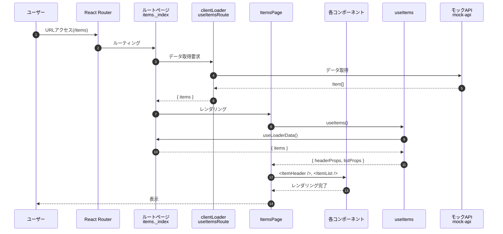
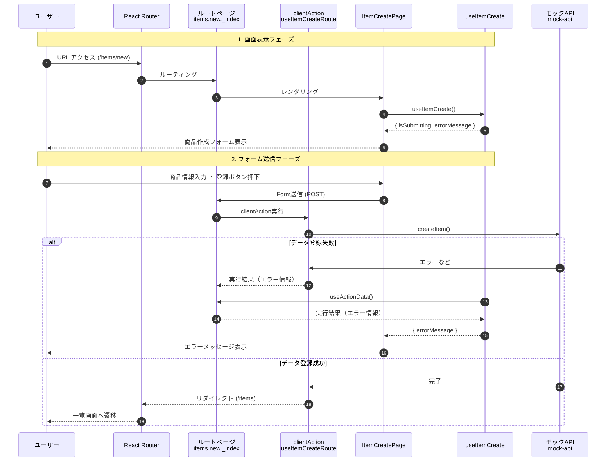
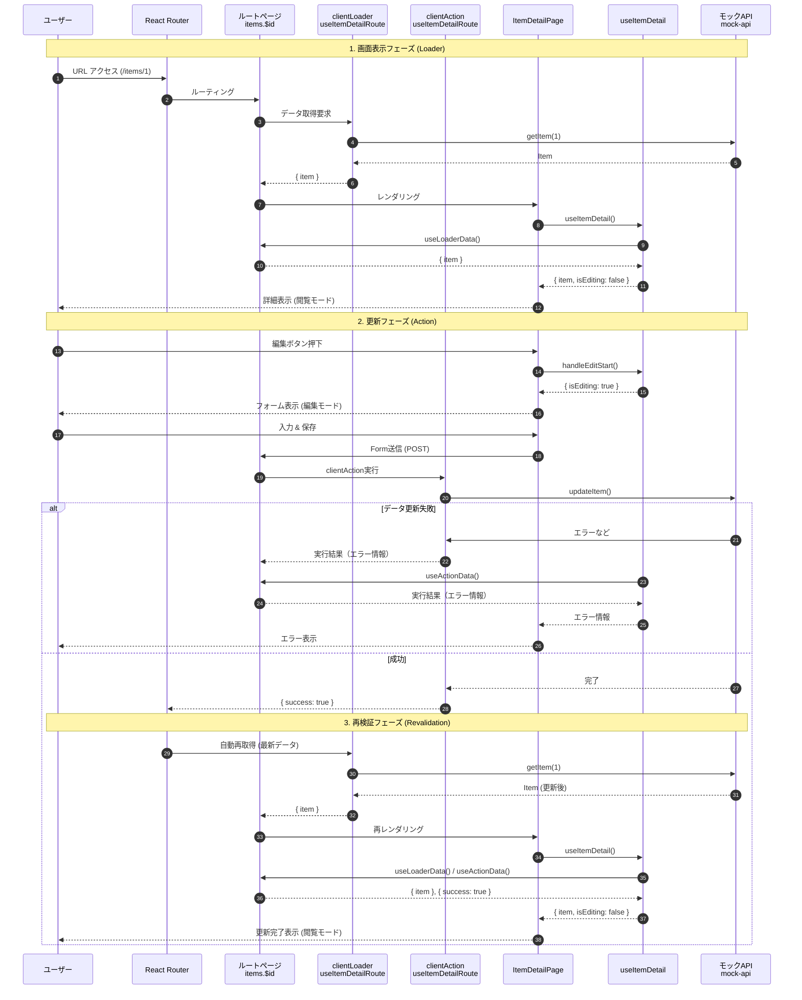

# 5. サンプルアプリ実装

React Router v7 の機能を活用して、商品管理アプリケーションを作成していきます。
本章では、以下の機能を順次実装していきます。

1.  セットアップ
2.  商品一覧画面
3.  商品作成画面
4.  商品詳細画面
5.  エラーハンドリング
6.  UI設定

この章では下記ブランチを利用します。  
`ch5/dev-sample-app`

## 5.1 セットアップ

まずは開発に必要なライブラリのインストールと、プロジェクトの基盤を整えます。

### 5.1.1 ライブラリインストール

UIコンポーネントライブラリとして Material UI (MUI) を使用します。
以下のコマンドを実行してインストールしてください。

```bash
pnpm add @mui/material @emotion/react @emotion/styled @mui/icons-material
```

### 5.1.2 ディレクトリ構成

機能ごとにフォルダを分ける「Feature-based」な構成を採用します。

```
app/
├── settings/              # アプリケーション設定
│   └── mui/               # テーマ設定（MUI）
├── assets/                # 静的リソース
│   ├── img/               # 画像
│   └── scss/              # SCSS
├── components/            # 共通コンポーネント
│   ├── elements/          # 基本UI要素
│   ├── errors/            # エラーコンポーネント
│   └── layouts/           # レイアウトコンポーネント
├── constants/             # アプリケーション定数（APIエンドポイントなど）
├── features/              # 機能モジュール
│   └── {feature}/         # 機能別
│       ├── components/    # 機能専用コンポーネント
│       ├── hooks/         # カスタムフック + Route handlers
│       │   ├── use{Feature}.ts      # ビジネスロジックフック
│       │   └── use{Feature}Route.ts # clientLoader/clientAction
│       ├── pages/         # ページコンポーネント
│       ├── stores/        # Client state（機能ローカル状態管理）
│       ├── api.ts         # API呼び出し
│       ├── constants.ts   # 定数定義
│       ├── schema.ts      # バリデーション定義
│       ├── types.ts       # 型定義
│       ├── utils.ts       # ユーティリティ関数
│       └── index.ts       # エクスポート
├── lib/                   # ライブラリ連携
├── routes/                # ルート定義（React Router v7）
├── stores/                # グローバルストア
├── types/                 # グローバル型定義
├── utils/                 # グローバルユーティリティ関数
└── root.tsx               # ルートコンポーネント
```

なお、このディレクトリ構成はあくまでベースとなる考え方を示したものです。
実際のプロジェクトでは、既存のフォルダに分類できないファイルが必要になることもあります。その際は、柔軟に適切なフォルダを追加・作成して対応する必要があります。

### 5.1.3 共通レイアウトの適用

`app/root.tsx` に共通レイアウトコンポーネント（`SampleLayout`）を適用し、全ページでヘッダーやサイドバーが表示されるようにします。

```tsx
// app/root.tsx
import { SampleLayout } from "./components/Layout/SampleLayout";

export default function App() {
  return (
    <SampleLayout>
      <Outlet />
    </SampleLayout>
  );
}
```

### 5.1.4 モックデータの作成

現時点ではまだAPIサーバーがないため、`app/features/items/mock-api.ts` に疑似的なデータと取得・作成関数を作成します。

まず、型定義を `app/features/items/types.ts` に作成しておきます。

```typescript
// app/features/items/types.ts
export interface Item {
  id: string;
  name: string;
  price: number;
  status: "on_sale" | "sold_out";
  description: string;
}
```

次に、モックデータを作成します。

```typescript
// app/features/items/mock-api.ts
import type { Item } from "~/features/items/types";

let items: Item[] = [
  {
    id: "item-001",
    name: "サンプル商品A",
    price: 1000,
    status: "on_sale",
    description: "使いやすさを追求した定番のアイテムです。オフィスや家庭で大活躍します。",
  },
  // ... 他のデータ
];

// 一覧取得
export async function getItems(): Promise<Item[]> {
  await new Promise((resolve) => setTimeout(resolve, 1000));
  return items;
}

// 詳細取得
export async function getItem(id: string): Promise<Item | undefined> {
  await new Promise((resolve) => setTimeout(resolve, 500));
  return items.find((item) => item.id === id);
}

// 作成
export async function createItem(params: { name: string; price: number; description?: string }): Promise<Item> {
  await new Promise((resolve) => setTimeout(resolve, 500));
  const newItem: Item = {
    id: `item-${Date.now()}`,
    name: params.name,
    price: params.price,
    status: "on_sale",
    description: params.description ?? "",
  };
  items = [...items, newItem];
  return newItem;
}

// 更新
export async function updateItem(id: string, params: {
  name?: string;
  price?: number;
  description?: string;
}): Promise<Item> {
  await new Promise((resolve) => setTimeout(resolve, 500));

  const index = items.findIndex((item) => item.id === id);
  if (index === -1) throw new Error("Item not found");

  const updatedItem = {
    ...items[index],
    ...params,
  };

  items = [
    ...items.slice(0, index),
    updatedItem,
    ...items.slice(index + 1),
  ];

  return updatedItem;
}

```

### 5.1.5 トップページ修正

初期状態のトップページを、アプリケーションの入り口として整備します。
MUIのカードコンポーネントを使用して、各機能へのリンクを配置します。

`app/routes/_index.tsx`

```tsx
import { Link as RouterLink } from "react-router";
import { Card, CardActionArea, CardContent, Typography, Grid, Container } from "@mui/material";
import InventoryIcon from '@mui/icons-material/Inventory';
import AddBoxIcon from '@mui/icons-material/AddBox';

export default function TopPage() {
  return (
    <Container maxWidth="md" sx={{ mt: 8 }}>
      <Grid container spacing={4} justifyContent="center">
        <Grid size={{ xs: 12, sm: 6 }}>
          <Card sx={{ height: '100%' }}>
            <CardActionArea 
              component={RouterLink} 
              to="/items" 
              sx={{ height: '100%', p: 2 }}
            >
              <CardContent sx={{ textAlign: "center" }}>
                <InventoryIcon sx={{ fontSize: 60, color: "primary.main", mb: 2 }} />
                <Typography variant="h5" component="h2" gutterBottom>
                  商品一覧
                </Typography>
              </CardContent>
            </CardActionArea>
          </Card>
        </Grid>

        <Grid size={{ xs: 12, sm: 6 }}>
          <Card sx={{ height: '100%' }}>
            <CardActionArea 
              component={RouterLink} 
              to="/items/new" 
              sx={{ height: '100%', p: 2 }}
            >
              <CardContent sx={{ textAlign: "center" }}>
                <AddBoxIcon sx={{ fontSize: 60, color: "secondary.main", mb: 2 }} />
                <Typography variant="h5" component="h2" gutterBottom>
                  商品作成
                </Typography>
              </CardContent>
            </CardActionArea>
          </Card>
        </Grid>
      </Grid>
    </Container>
  );
}
```

## 5.2 商品一覧画面

商品一覧画面の実装を通じて、React Router v7 の基本的なデータ取得→画面表示の流れを学びます。

### 5.2.1 ルートページ

ルートページは `clientLoader` とページコンポーネントを呼び出します。

```tsx
import { useItemsRouteHandlers } from "~/features/items/hooks/useItemsRoute";
import { ItemsPage } from "~/features/items/pages/ItemsPage";

// Loaderをエクスポートすることで、React Routerがデータ取得を管理
export const clientLoader = useItemsRouteHandlers.clientLoader;

export default function ItemsPageRoute() {
  return <ItemsPage />;
}
```

### 5.2.2 データ取得ロジック (clientLoader)

`clientLoader` は `app/features/items/hooks/useItemsRoute.ts` に定義します。

```typescript
import { getItems } from "../mock-api";

export const useItemsRouteHandlers = {
  clientLoader: async () => {
    const items = await getItems();
    return { items };
  },
};
```

### 5.2.3 ページコンポーネント

**app/features/items/pages/ItemsPage.tsx**
```tsx
export function ItemsPage() {
  const { headerProps, listProps } = useItems();
  return (
    <>
      <ItemPageHeader {...headerProps} />
      <ItemList {...listProps} />
    </>
  );
}
```

### 5.2.4 カスタムフック

ロジックとUIを分離するため、カスタムフック `useItems` を作成し、clietnLoaderで取得したデータや各コンポーネントで利用する関数を定義します。

**app/features/items/hooks/useItems.ts**
```typescript
export function useItems() {
  // clientLoaderの戻り値を型安全に取得
  const { items } = useLoaderData<typeof useItemsRouteHandlers.clientLoader>();
  const navigate = useNavigate();
  const revalidator = useRevalidator();

  const handleRefresh = () => {
    revalidator.revalidate();
  };

    const handleItemClick = (id: string) => () => {
    navigate(`/items/${id}`);
  };

  return {
    headerProps: {
      onRefresh: handleRefresh,
    },
    listProps: {
      items: items || [],
      onItemClick: handleItemClick,
    },
  };
}
```

### 5.2.5 UIコンポーネント

商品を表示するためのコンポーネントを作成します。

- **ItemCard**: 商品1件を表示するカード
- **ItemList**: カードをグリッド状に並べるリスト
- **ItemHeader**: ページタイトルと更新ボタン

※ コードは長くなるため省略します。実際のソースコードを確認してください。


### 5.2.6 データフロー

ここまでの実装で、React Router v7 の特徴的なデータフローが見えてきました。
データ取得から画面表示までの流れを整理すると、以下のようになります。

1.  **URL変更**: ユーザーが `/items` にアクセスします。
2.  **ルーティング**: React Router が URL に対応するルート（`items._index`）を特定します。
3.  **データ取得**: コンポーネントを表示する前に、`clientLoader` が自動的に実行され、モックAPIからデータを取得します。
4.  **レンダリング1**: 取得したデータ（`items`）を持って `ItemsPage` コンポーネントがレンダリングされます。
5.  **レンダリング2**: `useItems` フック経由でデータを受け取り、各コンポーネントを構築します。
6.  **表示**: レンダリングした画面をユーザーに表示します。

このように、コンポーネント側でデータ取得のタイミングを管理する必要がなく、React Routerが決められたタイミングでデータ取得を行ってくれます。



## 5.3 商品作成画面

商品作成画面では、フォーム送信とバリデーション、そしてデータ作成後のリダイレクト処理を実装します。
React Router v7 の `Form` コンポーネントと `clientAction` を組み合わせることで、`useState` を使わないシンプルなフォーム処理が可能になります。

### 5.3.1 ルートページ
```tsx
// Actionをエクスポートすることで、React Routerがデータ送信を管理
export const clientAction = useItemCreateRouteHandlers.clientAction;

export default function ItemCreatePageRoute() {
  return <ItemCreatePage />;
}
```

### 5.3.2 データ送信ロジック (clientAction)

フォームから送信されたデータを受け取り、バリデーションを行った上でモックデータの作成関数を呼び出すロジックを実装します。

まず、`app/features/items/hooks/useItemCreateRoute.ts` を実装します。

Reactでは `useState` でフォームの入力値を一つ一つ管理することが多いですが、React Router v7 では **送信ボタンが押されたタイミングで、入力された値をまとめて取得する** 方法（`FormData`）が推奨されています。
これにより、入力のたびに画面の再描画（レンダリング）が走ることがなくなり、パフォーマンスが向上します。また、コードの記述量も減らすことができます。

```typescript
export const useItemCreateRouteHandlers = {
  // ClientActionFunctionArgsは React Router の clientAction に渡される引数の型
  clientAction: async ({ request }: ClientActionFunctionArgs) => {
    const formData = await request.formData();
    const name = formData.get("name") as string;
    const priceStr = formData.get("price") as string;
    const description = formData.get("description") as string;

    try {
      await createItem({
        name,
        price: Number(priceStr),
        description,
      });

      return redirect("/items");
    } catch (e) {
      return {
        success: false,
        message: "登録に失敗しました",
      };
    }
  },
};
```

### 5.3.3 ページコンポーネント

MUI を使用してフォーム画面を作成します。React Router の `Form` コンポーネントを使用し、 `clientAction` が実行します。

`app/features/items/pages/ItemCreatePage.tsx`

```tsx
export function ItemCreatePage() {
  const { errorMessage, isSubmitting } = useItemCreate();

  return (
    <Paper sx={{ p: 4, maxWidth: 600, mx: "auto", mt: 4 }}>
      <Typography variant="h5" component="h1" gutterBottom sx={{ mb: 3 }}>
        商品作成
      </Typography>

      {errorMessage && (
        <Typography color="error" sx={{ mb: 2 }}>
          {errorMessage}
        </Typography>
      )}

      <Form method="post" noValidate>
        {/* name属性が clientAction でデータを取得する際のキー */}
        <Box sx={{ display: "flex", flexDirection: "column", gap: 3 }}>
          <TextField
            name="name"
            label="商品名"
            required
            disabled={isSubmitting}
            fullWidth
          />
          {/* ...他のフィールド... */}
          <Box sx={{ display: "flex", justifyContent: "flex-end", gap: 2 }}>
            <Button type="submit" variant="contained" disabled={isSubmitting}>
              {isSubmitting ? "登録中..." : "登録"}
            </Button>
          </Box>
        </Box>
      </Form>
    </Paper>
  );
}
```

### 5.3.4 カスタムフック

送信状態（`isSubmitting`）やサーバーからのレスポンス（エラーメッセージなど）を管理するためのフックを作成します。
`app/features/items/hooks/useItemCreate.ts` に記述します。

```typescript
export function useItemCreate() {
  const actionData = useActionData() as ActionData | undefined;
  const navigation = useNavigation();
  
  const isSubmitting = navigation.state === "submitting";
  const errorMessage = actionData?.success === false ? actionData?.message : null;

  return {
    errorMessage,
    isSubmitting,
  };
}
```


### 5.3.5 データフローの振り返り

商品作成画面における、画面表示からフォーム送信までの流れを整理します。
今回はデータの読み込み（Loader）がないため、初期表示はシンプルですが、フォーム送信（Action）の処理が加わります。

1.  **画面表示**: ユーザーが `/items/new` にアクセスすると、`clientLoader` は定義されていないため、即座に `ItemCreatePage` がレンダリングされます。
2.  **フォーム入力**: ユーザーが商品情報を入力し、「登録」ボタンを押します。
3.  **送信実行**: `<Form>` コンポーネントにより、React Router が `clientAction` を実行します。
4.  **バリデーション**: `clientAction` 内で入力値のチェックを行います。エラーがあれば `ActionData` としてエラー情報を返します。
5.  **エラー表示**: `useItemCreate` フックが `useActionData` を通じてエラー情報を受け取り、画面に表示します。
6.  **データ保存**: バリデーションを通過すれば、モックAPIを呼び出してデータを保存し、一覧画面へリダイレクトします。



## 5.4 商品詳細画面

商品詳細画面では、データの閲覧機能に加え、編集モードへの切り替えと更新機能を実装します。
React Router v7 の `clientLoader` でデータを取得し、`clientAction` で更新処理を行います。

### 5.4.1 ルートページ

```tsx
import { useItemDetailRouteHandlers } from "~/features/items/hooks/useItemDetailRoute";
import { ItemDetailPage } from "~/features/items/pages/ItemDetailPage";

export const clientLoader = useItemDetailRouteHandlers.clientLoader;
export const clientAction = useItemDetailRouteHandlers.clientAction;

export default function ItemDetailPageRoute() {
  return <ItemDetailPage />;
}
```

### 5.4.2 データ取得・更新ロジック (clientLoader / clientAction)

詳細データの取得と、更新時のバリデーション・保存処理を実装します。
`app/features/items/hooks/useItemDetailRoute.ts` に記述します。

```typescript
import type { ClientLoaderFunctionArgs, ClientActionFunctionArgs } from "react-router";
import { getItem, updateItem } from "../mock-api";

export const useItemDetailRouteHandlers = {
  // データ取得
  clientLoader: async ({ params }: ClientLoaderFunctionArgs) => {
    // URLパラメータからIDを取得
    const id = params.id;
    if (!id) throw new Error("IDが指定されていません");

    const item = await getItem(id);
    if (!item) throw new Response("商品が見つかりません", { status: 404, statusText: "Not Found" });

    return { item };
  },

  // データ更新
  clientAction: async ({ request, params }: ClientActionFunctionArgs) => {
    const id = params.id;
    if (!id) throw new Error("IDが指定されていません");

    const formData = await request.formData();
    const name = formData.get("name") as string;
    const priceStr = formData.get("price") as string;
    const description = formData.get("description") as string;

    try {
      await updateItem(id, {
        name,
        price: Number(priceStr),
        description,
      });
      return { success: true };
    } catch (e) {
      return { success: false, message: "更新に失敗しました" };
    }
  },
};
```


### 5.4.3 ページコンポーネント

`isEditing` の状態に応じて、表示用コンポーネントと編集用フォーム（`Form`）を切り替えて表示します。
`app/features/items/pages/ItemDetailPage.tsx`

```tsx
export function ItemDetailPage() {
  const { item, isEditing, isSubmitting, handleEditStart, handleEditCancel, errorMessage } = useItemDetail();

  return (
    <Paper sx={{ p: 4, maxWidth: 600, mx: "auto", mt: 4 }}>
      {/* ヘッダー部分（タイトル・ステータス） */}
      <Box sx={{ display: "flex", justifyContent: "space-between", alignItems: "center", mb: 3 }}>
        <Typography variant="h5" component="h1">商品詳細</Typography>
        <Chip label={item.status === "on_sale" ? "販売中" : "売り切れ"} />
      </Box>

      {/* エラーメッセージ表示 */}
      {errorMessage && <Typography color="error">{errorMessage}</Typography>}

      {isEditing ? (
        // 編集モード: フォームを表示
        <Form method="post" noValidate>
          <Box sx={{ display: "flex", flexDirection: "column", gap: 3 }}>
            <TextField
              name="name"
              label="商品名"
              defaultValue={item.name}
              disabled={isSubmitting}
            />
            <TextField
              name="price"
              label="価格"
              type="number"
              defaultValue={item.price}
              disabled={isSubmitting}
            />
            <TextField
              name="description"
              label="説明"
              multiline
              rows={4}
              defaultValue={item.description}
              disabled={isSubmitting}
            />
            <Box sx={{ display: "flex", justifyContent: "flex-end", gap: 2 }}>
              <Button onClick={handleEditCancel}>キャンセル</Button>
              <Button type="submit" variant="contained">保存</Button>
            </Box>
          </Box>
        </Form>
      ) : (
        // 閲覧モード: テキストを表示
        <Box sx={{ display: "flex", flexDirection: "column", gap: 3 }}>
          <Box>
            <Typography variant="caption">商品名</Typography>
            <Typography variant="body1">{item.name}</Typography>
          </Box>
          <Box>
            <Typography variant="caption">価格</Typography>
            <Typography variant="body1">¥{item.price.toLocaleString()}</Typography>
          </Box>
          <Box>
            <Typography variant="caption">説明</Typography>
            <Typography variant="body1" sx={{ whiteSpace: "pre-wrap" }}>{item.description}</Typography>
          </Box>
          <Box sx={{ display: "flex", justifyContent: "flex-end", gap: 2 }}>
            <Button component={Link} to="/items">一覧へ戻る</Button>
            <Button variant="contained" onClick={handleEditStart}>編集</Button>
          </Box>
        </Box>
      )}
    </Paper>
  );
}
```

### 5.4.4 カスタムフック

閲覧モードと編集モードの切り替え状態（`isEditing`）や、更新成功時のハンドリングを管理するフックを作成します。
`app/features/items/hooks/useItemDetail.ts` に記述します。

```typescript
export function useItemDetail() {
  const { item } = useLoaderData<typeof useItemDetailRouteHandlers.clientLoader>();
  const actionData = useActionData() as ActionResult | undefined;
  const navigation = useNavigation();
  
  const [isEditing, setIsEditing] = useState(false);

  // 更新成功時に編集モードを終了して閲覧モードに戻る
  useEffect(() => {
    if (actionData?.success) {
      setIsEditing(false);
    }
  }, [actionData]);

  const handleEditStart = () => setIsEditing(true);
  const handleEditCancel = () => setIsEditing(false);

  const isSubmitting = navigation.state === "submitting";

  return {
    item,
    isEditing,
    isSubmitting,
    handleEditStart,
    handleEditCancel,
    errorMessage: actionData?.success === false ? actionData.message : undefined,
  };
}
```

### 5.4.5 データフローの振り返り

商品詳細画面は、これまでの集大成として「データ取得（Loader）」と「データ更新（Action）」の両方を行います。
データ取得から画面表示、そして更新までの流れを整理すると、以下のようになります。

1.  **画面表示**: ユーザーが `/items/1` などにアクセスすると、`clientLoader` が実行され、データを取得します。
2.  **レンダリング**: `ItemDetailPage` がレンダリングされ、`useItemDetail` フック内で `useLoaderData` を通じてデータを取得します。
3.  **編集モード**: ユーザー操作により `useItemDetail` 内のステートが変化し、表示モードから編集モード（フォーム）に切り替わります。
4.  **更新実行**: フォーム送信により `clientAction` が実行され、データ更新を行います。
5.  **データ再取得 (Revalidation)**: 更新成功後、React Router が自動的に `clientLoader` を再実行し、最新データを取得して画面を更新します。



## 5.5 ErrorBoundary

React Router v7 では、ルートコンポーネントで例外（Error）がスローされると、個別にtry-catchされていない場合 `ErrorBoundary` がレンダリングされます。
これにより、予期せぬエラーが発生した場合でも、アプリケーション全体がクラッシュすることなく、ユーザーフレンドリーなエラー画面を表示できます。

本節では、適切なエラーメッセージを表示するErrorBoundaryのUIを実装します。

### 5.5.1 エラーコンポーネントの作成

まずはエラー表示用のコンポーネントを作成します。
`useRouteError` フックを使用することで、スローされたエラーの内容にアクセスできます。

`app/components/elements/AppErrorBoundary.tsx`

```tsx
export function AppErrorBoundary() {
  const error = useRouteError();

  return (
    <Container maxWidth="sm">
      <Box
        sx={{
          display: 'flex',
          flexDirection: 'column',
          alignItems: 'center',
          justifyContent: 'center',
          minHeight: '100vh',
          textAlign: 'center',
          gap: 3,
        }}
      >
        <ErrorOutline sx={{ fontSize: 80, color: 'error.main' }} />

        <Typography variant="h4" component="h1" gutterBottom>
          エラーが発生しました
        </Typography>

        <Typography variant="body1" color="text.secondary">
          {error instanceof Error ? error.message : String(error)}
        </Typography>

        <Button variant="contained" startIcon={<Home />} component={Link} to="/" size="large">
          ホームに戻る
        </Button>
      </Box>
    </Container>
  );
}
```

### 5.5.2 ルートへの適用

作成した `AppErrorBoundary` を `app/root.tsx` でエクスポートします。
ルート（Root）ルートでエクスポートすることで、アプリケーション内のあらゆる場所で発生した未捕捉のエラーをキャッチできるようになります。

`app/root.tsx`

```tsx
// ... 他のインポート

// ファイルの末尾などでエクスポート
export { AppErrorBoundary as ErrorBoundary } from "./components/elements/AppErrorBoundary";
```

### 5.5.3 動作確認

モックデータ (`app/features/items/mock-api.ts`) の `getItems` 関数などで意図的にエラーをスローするように変更し、エラー画面が表示されるか確認してみましょう。

```typescript
// app/features/items/mock-api.ts
export async function getItems(): Promise<Item[]> {
  // テスト用にエラーをスロー
  throw new Error("データの取得に失敗しました (500 Internal Server Error)");
  
  // ...
}
```

ブラウザで `/items` にアクセスすると、先ほどのスタックトレースではなく、作成したエラー画面が表示されるはずです。
確認後はモックのエラーを元に戻しておきましょう。

## 5.6 MUI設定（共通スタイルなど）

アプリケーション全体のデザイン統一感を出すために、MUIのテーマ設定を行います。
`createTheme` と `ThemeProvider` を使用することで、カラーパレットやコンポーネントのデフォルトスタイルを一括で管理できます。

### 5.6.1 テーマオプションの定義

`app/settings/mui/theme.ts` にテーマ設定を記述します。
ここでは、ボタンの形状やカードの影、フォント設定などをカスタマイズしています。

themeの項目やデフォルト設定値については下記公式サイトから確認できます。  
https://mui.com/material-ui/customization/default-theme/

```typescript
export const theme = createTheme({
  palette: {
    primary: {
      main: "#1976d2", // メインカラー（青）
    },
    secondary: {
      main: "#dc004e", // アクセントカラー（赤紫）
    },
    background: {
      default: "#f8f9fa", // アプリケーション全体の背景色（薄いグレー）
    },
  },
  typography: {
    // フォントファミリー設定は削除（デフォルトを使用）
    h1: { fontSize: "2.5rem", fontWeight: 600 }, // 見出し1のサイズと太さ
    h2: { fontSize: "2rem", fontWeight: 600 },   // 見出し2のサイズと太さ
    h3: { fontSize: "1.75rem", fontWeight: 600 }, // 見出し3のサイズと太さ
  },
  components: {
    MuiButton: {
      defaultProps: {
        disableElevation: true, // ボタンの影（浮き上がり）を無効化してフラットなデザインにする
      },
      styleOverrides: {
        root: {
          textTransform: "none", // アルファベットの自動大文字変換を無効化
          borderRadius: 8,       // ボタンの角丸の半径
          fontWeight: "bold",    // 文字の太さ
        },
      },
    },
    MuiCard: {
      styleOverrides: {
        root: {
          borderRadius: 12, // カードの角丸
          boxShadow: "0 2px 8px rgba(0,0,0,0.08)", // 独自の影設定（デフォルトより柔らかく控えめな影）
        },
      },
    },
    MuiTextField: {
      defaultProps: {
        variant: "outlined", // 入力欄のスタイルをデフォルトで「枠線付き」にする
        size: "small",       // 入力欄のサイズをデフォルトで「小さめ」にする
      },
    },
  },
});
```

### 5.6.2 アプリケーションへの適用

`app/root.tsx` で `ThemeProvider` を設定し、アプリ全体にテーマを適用します。
また、`CssBaseline` コンポーネントを配置します。

**CssBaselineが必要な理由**

Webブラウザ（Chrome, Safari, Edgeなど）は、それぞれ独自の「デフォルトのスタイル」を持っています。例えば、見出しの文字サイズや、ページの余白などが微妙に異なります。
そのため、何も対策をしないと「Chromeでは綺麗に見えるのに、Safariだとレイアウトが崩れる」といった問題が起きてしまいます。

`CssBaseline` は、MUIが提供する強力な「リセットCSS」です。これを使うことで以下のメリットがあります。

1.  **ブラウザ間の差異をなくす**: どのブラウザで見ても同じ見た目になるように、デフォルトのスタイルを統一（リセット）します。いわば、絵を描く前に「画用紙を真っ白にする」作業です。
2.  **MUIに適した土台を作る**: 単にリセットするだけでなく、MUIのコンポーネントが正しく動作するために必要な基本設定（`box-sizing: border-box` など）を適用します。

これを入れることで、開発者はブラウザごとの細かい違いを気にせず、UIの構築に集中できるようになります。

```tsx
import { createTheme, ThemeProvider, CssBaseline } from "@mui/material";
import { baseThemeOptions } from "./settings/mui/theme";

// ...

export default function App() {
  // テーマの生成
  const theme = createTheme(baseThemeOptions);

  return (
    <ThemeProvider theme={theme}>
      {/* CSSリセットと基本スタイルの適用 */}
      <CssBaseline />
      <SampleLayout>
        <Outlet />
      </SampleLayout>
    </ThemeProvider>
  );
}
```

これにより、個別のコンポーネントでスタイルを指定しなくても、アプリ全体で統一されたデザイン（ボタンの角丸やカードの影など）が適用されるようになります。

## 5.7 まとめ

本章では、React Router v7 と Material UI を使用して、商品管理アプリケーションの基本機能を実装しました。

- **Feature-basedなディレクトリ構成**: 機能ごとにコードを整理し、保守性を高めました。
- **React Router v7**: `clientLoader` / `clientAction` を活用し、データフェッチとフォーム処理を宣言的に実装しました。
- **Material UI**: コンポーネントライブラリを活用し、素早くリッチなUIを構築しました。
- **エラーハンドリング**: `ErrorBoundary` を導入し、堅牢なアプリケーション基盤を作りました。
- **テーマ設定**: `ThemeProvider` でデザインの一貫性を担保しました。

これにて、アプリケーションの「UI」と「基本動作（ルーティング）」が完成しました。
次章以降では、このアプリケーションをベースとして、より実践的なライブラリの導入と活用方法を解説していきます。

ライブラリを組み合わせることで、よりスケーラブルでメンテナンス性の高いアプリケーションへと進化させていきます。