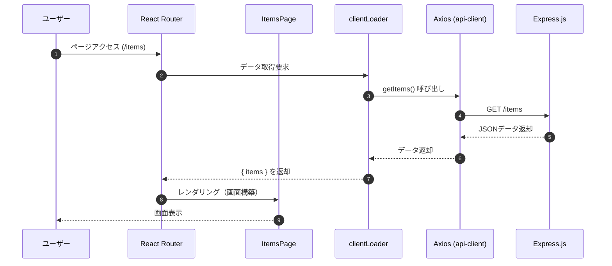

# 6. API通信 (Axios & Express)

これまでは `mock-item.ts` というファイル内の関数を使って、擬似的にデータを取得・保存していました。
本章では、より実践的な開発環境に近づけるため、以下のステップで「実際のHTTP通信」を行うようにアプリを改修します。

## 6.1 モックサーバーの構築 (Express.js)

まずは、データを返却してくれる「APIサーバー」を用意します。
今回は、Node.js で動く軽量なWebフレームワーク **Express.js** を使用します。
Reactアプリとは別のプロジェクトとして管理するため、専用のフォルダを作成します。

この章では下記ブランチを利用します。  
`ch6-1/setup-mock`

### 6.1.1 サーバー用プロジェクトの作成

プロジェクトルートに `mock_server` ディレクトリを作成し、Expressなどの必要なライブラリをインストールします。
TypeScriptで開発するため、`ts-node` や型定義ファイルもインストールします。

```bash
# mock_serverディレクトリの作成と移動
mkdir mock_server
cd mock_server

# package.jsonの初期化
pnpm init

# Expressと関連ライブラリのインストール
pnpm add express cors body-parser

# TypeScript関連の開発用ライブラリをインストール
pnpm add -D typescript ts-node @types/express @types/cors @types/body-parser @types/node tsx
```

その後、`package.json` の `scripts` を以下のように修正して、起動コマンドを定義します。
`tsx watch` コマンドを使用することで、TypeScript ファイルを直接実行しつつ、ファイルの変更を検知してサーバーを自動再起動するように設定します。

**mock_server/package.json**

```json
{
  "name": "mock-server",
  "version": "1.0.0",
  "main": "server.ts",
  "scripts": {
    "start": "tsx watch server.ts"
  },
  "dependencies": {
    "body-parser": "^1.20.2",
    "cors": "^2.8.5",
    "express": "^4.18.2"
  },
  "devDependencies": {
    "@types/body-parser": "^1.19.5",
    "@types/cors": "^2.8.17",
    "@types/express": "^4.17.21",
    "@types/node": "^20.11.0",
    "ts-node": "^10.9.2",
    "tsx": "^4.21.0",
    "typescript": "^5.3.3"
  }
}
```

また、TypeScriptの設定ファイル `tsconfig.json` を作成します。
アプリ側の設定に合わせて `ES2022` をターゲットにしつつ、Node.js 環境で動作するように `moduleResolution` は `NodeNext` を指定します。

**mock_server/tsconfig.json**

```json
{
  "compilerOptions": {
    "target": "ES2022",
    "module": "NodeNext",
    "moduleResolution": "NodeNext",
    "strict": true,
    "esModuleInterop": true,
    "skipLibCheck": true,
    "forceConsistentCasingInFileNames": true
  }
}
```

### 6.1.2 サーバーコードの作成

`mock_server` ディレクトリ内に `server.ts` を作成します。
TypeScript を使うことで、リクエストやレスポンスの型を意識しながらコードを書くことができます。

**mock_server/server.ts**

```typescript
import express, { type Request, type Response } from 'express';
import cors from 'cors';
import bodyParser from 'body-parser';

const app = express();
const PORT = 3000;

// CORS (Cross-Origin Resource Sharing) を有効化
// 異なるドメイン (Reactアプリ: localhost:5173) からのアクセスを許可する
app.use(cors());

// リクエストボディのJSONをパースして req.body でアクセスできるようにする
app.use(bodyParser.json());

// 商品データの型定義
interface Item {
  id: string;
  name: string;
  price: number;
  status: "on_sale" | "sold_out";
  description: string;
}

// 商品作成用パラメータの型定義
interface CreateItemParams {
  name: string;
  price: number;
  description?: string;
}

// インメモリデータストア
let items: Item[] = [
  { id: "1", name: "高級腕時計", price: 150000, status: "on_sale", description: "洗練されたデザインの高級腕時計です。" },
  { id: "2", name: "ワイヤレスイヤホン", price: 12000, status: "on_sale", description: "高音質でノイズキャンセリング機能付き。" },
  // ...other items...
];

// GET /items
app.get('/items', (req: Request, res: Response) => {
  // テスト用エラーコード
  // res.status(500).json();
  
  console.log('GET /items');
  res.json(items);
});

// GET /items/:id
app.get('/items/:id', (req: Request, res: Response) => {
  const id = req.params.id;
  console.log(`GET /items/${id}`);
  const item = items.find((i) => i.id === id);
  if (item) {
    res.json(item);
  } else {
    res.status(404).json({ message: 'Not Found' });
  }
});

// POST /items
app.post('/items', (req: Request, res: Response) => {
  // テスト用エラーコード
  // res.status(500).json();

  const body = req.body as CreateItemParams;
  console.log('POST /items', body);

  const newItem: Item = {
    id: String(Date.now()),
    ...body,
    status: "on_sale",
    description: body.description || "",
  };
  items.push(newItem);
  res.status(201).json(newItem);
});

// PUT /items/:id
app.put('/items/:id', (req: Request, res: Response) => {
  const id = req.params.id;
  console.log(`PUT /items/${id}`, req.body);
  const index = items.findIndex((i) => i.id === id);
  if (index !== -1) {
    items[index] = { ...items[index], ...req.body };
    res.json(items[index]);
  } else {
    res.status(404).json({ message: 'Not Found' });
  }
});

// DELETE /items/:id
app.delete('/items/:id', (req: Request, res: Response) => {
  const id = req.params.id;
  console.log(`DELETE /items/${id}`);
  items = items.filter((i) => i.id !== id);
  res.status(204).send();
});

// サーバーを起動し、指定されたポートでリクエストを待機する
app.listen(PORT, () => {
  console.log(`Mock server running on http://localhost:${PORT}`);
});
```

### 6.1.3 起動スクリプトの設定

Reactの開発サーバーと、ExpressのAPIサーバーをコマンド一つで同時に起動できるようにします。
管理しやすくするため、それぞれの起動コマンドを `dev:app`, `dev:mock` として定義し、`start` コマンドでそれらを呼び出すように `package.json` の `scripts` を修正します。
また、複数のコマンドを同時に実行するために `concurrently` というパッケージを使用します。

まず、**アプリのルートディレクトリ**で `concurrently` をインストールします（モックサーバー側には不要です）。

```bash
# プロジェクトルートで実行
pnpm add -D concurrently
```

次に、**アプリのルートディレクトリにある** `package.json` を以下のように修正します。
ログが見やすくなるように、`concurrently` のオプションで色分けを指定します。

**package.json**

```json
  "scripts": {
    "build": "react-router build",
    "dev": "react-router dev",
    "dev:app": "react-router dev",
    "dev:mock": "cd mock_server && pnpm start",
    "start": "concurrently -c \"bgBlue.bold,bgMagenta.bold\" \"pnpm dev:app\" \"pnpm dev:mock\"",
    "typecheck": "react-router typegen && tsc"
  },
```

これで、`pnpm start` を実行すると、一つのターミナル内で React Router と Express サーバーが同時に起動します。
ログも色分けされて表示されるため、どちらの出力か判別しやすくなります。

ブラウザで `http://localhost:3000/items` にアクセスし、JSONデータが表示されればサーバーの準備は完了です。

## 6.2 Axios導入

Axiosは、ブラウザやNode.jsで動作する、PromiseベースのHTTPクライアントライブラリです。
React開発においてはデファクトスタンダードと言えるほど広く使われています。

本セクションでは、このAxiosを使って、先ほど作成したExpressサーバーと通信する機能を実装していきます。

まずは、Axiosをインストールし、最も基本的な設定でサーバーからデータを取得してみましょう。

この章では下記ブランチを利用します。  
`ch6-2/setup-axios`

### 6.2.1 インストール

下記コマンドを実行してAxiosをインストールします。

```bash
pnpm add axios
```

### 6.2.2 クライアント作成

`app/core/api/api-client.ts` を作成し、`Axios.create` でインスタンスを作ります。

ここで作成するのは、アプリ専用の「通信窓口（クライアント）」です。
これを作っておくことで、毎回 `http://localhost:3000` というURLを書く必要がなくなり、共通の設定（タイムアウト時間やヘッダー情報など）をまとめて管理できるようになります。
いわば、APIサーバーへの「直通電話」を用意しておくようなイメージです。

**app/lib/api-client.ts**

```typescript
import Axios, { type AxiosInstance } from "axios";

const BASE_URL = import.meta.env.VITE_API_BASE_URL || "http://localhost:3000";

export const api: AxiosInstance = Axios.create({
  baseURL: BASE_URL,
  timeout: 10000,
  headers: {
    "Content-Type": "application/json",
  },
});
```

### 6.2.3 データ取得実装

API通信を行う関数を定義し、それをコンポーネント（`clientLoader`）から呼び出すようにします。  
直接コンポーネント内で `api.get` を呼ぶのではなく、機能ごとにAPI呼び出しをまとめたファイルを作ると管理しやすくなります。

**1. API関数の定義**

`api.ts` を作成し、商品一覧を取得する関数 `getItems` を定義します。
先ほど作った「通信窓口 (api)」を使って、サーバーの `/items` というパスにアクセスし、データを取得するだけのシンプルな関数です。

**app/features/items/api.ts**

```typescript
export const getItems = async () => {
  // GET /items へのリクエスト
  const response = await api.get<Item[]>("/items");
  return response.data;
};
```

**2. clientLoaderでの呼び出し**

商品一覧ページの`clientLoader`で、モックデータの代わりに `getItems` を呼び出すように修正します。

**app/features/items/hooks/useItemsRoute.ts**

```typescript
import { getItems } from "../api";

export const useItemsRouteHandlers = {
  clientLoader: async () => {
    const items = await getItems();
    return { items };
  },
};
```

**3. 動作確認**

1. `pnpm start` でアプリとサーバーを起動します。
2. ブラウザで商品一覧ページ (`http://localhost:5173/items`) を開きます。
3. モックサーバー (`mock_server/server.js`) に定義されている「高級腕時計」や「ワイヤレスイヤホン」などのデータが表示されていることを確認してください。
4. これで、Reactアプリが実際のAPIサーバーからデータを取得して表示できるようになりました。

ここまでの実装で、ユーザーがページにアクセスしてからデータが表示されるまでの流れは以下のようになります。



## 6.3 インターセプター

Axiosの強力な機能の一つに「インターセプター」があります。
これは、リクエストが送信される前や、レスポンスがコードに渡される前に、処理を挟み込むことができる機能です。

この章では下記ブランチを利用します。  
`ch6-3/axios-interceptor`

### 6.3.1 リクエストインターセプター

リクエスト送信時に、共通の処理を挟み込むことができます。
実際の開発現場では、以下のような処理をここで行うことが一般的です。

1.  **認証情報の付与**: すべてのリクエストヘッダーにAPIキーやアクセストークンを自動的に追加する。
2.  **ログ出力**: デバッグ用に、どのようなリクエストが飛んでいるかをコンソールに出力する。

ここでは例として、環境変数 `VITE_API_ACCESS_KEY` からキーを取得してヘッダーにセットしつつ、リクエストの内容をログに出力する設定を追加します。

**app/core/api/api-client.ts**

```typescript
// ... (Axios.createの後)

const authRequestInterceptor = (config: any) => {
  // ログ出力
  console.log(`[Request] ${config.method?.toUpperCase()} ${config.url}`);

  // APIアクセスキーの付与
  const apiAccessKey = import.meta.env.VITE_API_ACCESS_KEY;
  if (apiAccessKey) {
    config.headers.Authorization = `Bearer ${apiAccessKey}`;
  }
  return config;
};

api.interceptors.request.use(authRequestInterceptor);
```

**動作確認**

- 商品一覧にアクセスすると、`[Request] GET /items` のようなログが出力されていることを確認してください。
- itemsへのリクエストについて、「Headers」タブの「Request Headers」の中に、`Authorization: Bearer ...` が付与されていることを確認してください（環境変数を要設定）。

### 6.3.2 レスポンスインターセプター

Axiosは通常、レスポンスを `{ data: ..., status: ..., headers: ... }` というオブジェクトで返しますが、
アプリケーション側では `data` のみに関心があることがほとんどです。
レスポンスインターセプターを使って、自動的に `data` プロパティの中身だけを返すようにします。

**app/core/api/api-client.ts**

```typescript
// ... (リクエストインターセプターの後)

const responseSuccessInterceptor = (response: any) => {
  // レスポンス全体ではなく、dataプロパティの中身だけを返す
  return response.data;
};

api.interceptors.response.use(responseSuccessInterceptor);
```

**型定義の修正**

インターセプターでデータを抽出するようにしたため、`api.get` などの戻り値の型定義と、実際の戻り値（`data` のみ）が一致しなくなります。
そこで、`ApiClient` という独自の型を定義し、`get` や `post` が直接データを返すように型定義を上書きします。

**app/core/api/api-client.ts**

```typescript
import Axios, { type AxiosInstance, type AxiosRequestConfig } from "axios";

// ... (BASE_URL定義など)

// Axiosのメソッドがデータを直接返すように型定義を拡張
export interface ApiClient extends AxiosInstance {
  get<T = any>(url: string, config?: AxiosRequestConfig): Promise<T>;
  post<T = any>(url: string, data?: any, config?: AxiosRequestConfig): Promise<T>;
  put<T = any>(url: string, data?: any, config?: AxiosRequestConfig): Promise<T>;
  delete<T = any>(url: string, config?: AxiosRequestConfig): Promise<T>;
  patch<T = any>(url: string, data?: any, config?: AxiosRequestConfig): Promise<T>;
}

export const api = Axios.create({
  // ... (設定)
}) as ApiClient;
```

こうすることで、呼び出し元で毎回 `.data` を取り出す手間が省け、コードがスッキリして扱いやすくなります。
「APIを呼んだら、データそのものが返ってくる」という直感的なコードが書けるようになります。

具体的には、`getItems()` の戻り値の型が以下のように変化し、扱いやすくなります。

*   **修正前**: `Promise<AxiosResponse<Item[]>>`
    *   データを使うには `response.data` と書く必要がある。
*   **修正後**: `Promise<Item[]>`
    *   データが直接返ってくるため、そのまま使える。

**呼び出し元の修正**

`api.ts` などの呼び出し元で `.data` にアクセスする必要がなくなります。

**app/features/items/api.ts**

```typescript
export const getItems = async () => {
  // response.data が直接返ってくるようになる
  // 戻り値はPromise<Item[]>となる
  return await api.get<Item[]>("/items");
};
```

**動作確認**

- アプリを操作して、商品一覧が正常に表示されることを確認します。

## 6.4 エラーハンドリング

API通信は、ネットワークエラーやサーバーエラーなど、様々な理由で失敗する可能性があります。
ここでは、データの作成（POST）や更新（PUT）処理を追加し、その際のエラーハンドリングの実装例を紹介します。

この章では下記ブランチを利用します。  
`ch6-4/axios-error-handling`

### 6.4.1 データ作成・更新関数の追加

まず、`app/features/items/api.ts` に商品を作成する関数 `createItem` と更新する関数 `updateItem` を追加します。

**app/features/items/api.ts**

```typescript
import { api } from "~/lib/api-clients";
import type { CreateItemParams, Item } from "./types";

export const getItems = async () => {
  // GET /items へのリクエスト
  return await api.get<Item[]>("/items");
};

export const getItem = async (id: string) => {
  // GET /items/:id へのリクエスト
  return await api.get<Item>(`/items/${id}`);
};

export const createItem = async (newItem: CreateItemParams) => {
  // POST /items へのリクエスト
  return await api.post<Item>("/items", newItem);
};

// Partial<Item> は、Item型のすべてのプロパティを任意（Optional）
// これにより、更新したい項目だけを含むオブジェクトを渡すことができる
export const updateItem = async (id: string, item: Partial<Item>) => {
  // PUT /items/:id へのリクエスト
  return await api.put<Item>(`/items/${id}`, item);
};
```

### 6.4.2 エラーハンドリングの実装

商品作成を行うコンポーネント（またはAction）で、`try-catch` を使ってエラーを捕捉します。

ここでは、以下のような方針でエラーハンドリングを行います。

1.  **400 Bad Request (入力ミスなど)**: ユーザーが修正可能なエラーなので、画面にエラーを表示してユーザーに通知します。
2.  **その他のエラー (500 Server Errorなど)**: ユーザーには対処できないエラーなので、`throw error` で再スローし、React Router の `ErrorBoundary` に処理を委譲します（エラー画面が表示されます）。

```typescript
export const useItemCreateRouteHandlers = {
  // ClientActionFunctionArgsは React Router の clientAction に渡される引数の型
  clientAction: async ({ request }: ClientActionFunctionArgs) => {
    const formData = await request.formData();
    const name = formData.get("name") as string;
    const priceStr = formData.get("price") as string;
    const description = formData.get("description") as string;

    try {
      await createItem({
        name,
        price: Number(priceStr),
        description,
      });

      return redirect("/items");
    } catch (error) {
      // 400 Bad Request の場合 (入力値不備など)
      // サーバーからのエラーメッセージを表示して、ユーザーに修正を促す
      if (isAxiosError(error) && error.response?.status === 400) {
        return {
          success: false,
          message: "登録に失敗しました",
        };
      } else {
        // その他のエラー (500エラーやネットワークエラーなど)
        // ここでは処理せず再スローし、上位の ErrorBoundary でキャッチさせる
        throw error;
      }
    }
  },
};
```

**ポイント:**

1.  **`try-catch` ブロック**: 非同期処理（`await`）を囲むことで、Promiseがrejectされた場合（APIエラー時）に `catch` ブロックに処理が移ります。
2.  **`isAxiosError`**: エラーオブジェクトがAxios由来のものかどうかを判定するユーティリティ関数です。
3.  **`error.response`**: サーバーからのレスポンス情報が入っています。`status` でステータスコード（400, 404, 500など）、`data` でレスポンスボディ（エラーメッセージなど）にアクセスできます。

このように、ステータスコードに応じた適切なメッセージをユーザーに表示することで、UX（ユーザー体験）を向上させることができます。

### 6.4.3 動作確認

最後に、実装したエラーハンドリングが正しく動作するか確認します。
モックサーバーのコードを一時的に修正して、意図的にエラーを発生させてみましょう。

**1. 商品作成のエラーハンドリング確認**

`mock_server/server.ts` の `POST /items` を修正してエラーを返すようにします。

```typescript
// POST /items
app.post('/items', (req: Request, res: Response) => {
  // テスト用エラーコード
  res.status(400).json();

  // ... 通常の処理 ...
});
```

修正後、商品作成を実行すると下記の結果になることを確認できます。

- テスト用エラーコードをコメントアウト
  →**一覧画面へ遷移し、登録されていること**
- テスト用エラーコードのステータスを`400`に設定
  →**画面遷移せず、フォーム上に「登録に失敗しました」と表示されること**
- テスト用エラーコードのステータスを`500`に設定
  →**システムエラー画面（ErrorBoundary）が表示されること**

**2. 商品一覧のエラーハンドリング確認**

次に、商品一覧取得時のエラーを確認します。
`mock_server/server.ts` の `GET /items` を修正します。

```typescript
app.get('/items', (req: Request, res: Response) => {
  // テスト用エラーコード
  res.status(400).json();

  // ... 通常の処理 ...
});
```

修正後、ブラウザで商品一覧ページにアクセスします。

*   **全エラー共通**: `clientLoader` では `try-catch` をしていないため、400エラーでも500エラーでも、**システムエラー画面（ErrorBoundary）が表示されること**。

確認が終わったら、モックサーバーのコードを元に戻しておきましょう。

