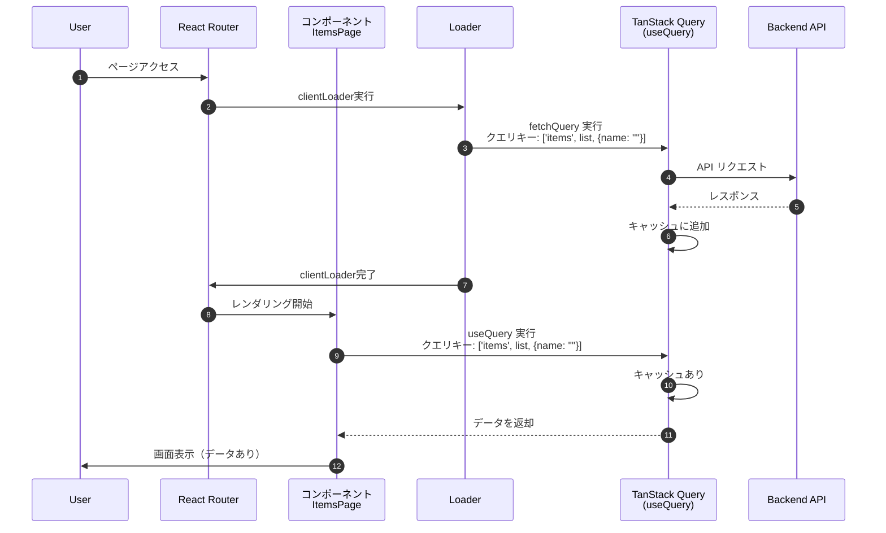

# 7. TanStack Query によるデータ管理

本章では、**TanStack Query (React Query)** を導入して、データ（サーバー状態）の管理を効率化します。

## 7.1 TanStack Query とは

Webアプリケーションでのデータ取得には、いくつかの手法がありますが、それぞれに課題があります。

**1. useEffect / useState (Traditional)**
*   **状態管理の複雑さ**: `isLoading`, `error` などの状態管理を行う必要がありコードが煩雑になる。
*   **キャッシュなし**: コンポーネントがマウントされるたびにリクエストが発生する。

**2. React Router loader / action (Framework Mode)**
*   **キャッシュ制御が弱い**: 基本的にページ遷移のたびに `loader` が再実行されるため、「戻る」ボタンでの遷移でも通信が発生してしまう。
*   **手動でのデータ更新**: 取得済みのデータが古い場合のデータ更新を自前で実装する必要がある。

TanStack Query は、これらの問題を解決するライブラリです。
強力なキャッシュ機能と宣言的なAPIにより、「サーバーからのデータ取得、キャッシュ、更新」を驚くほど簡単に扱えるようになります。
React Router Frameworkモードと組み合わせることで、より強力なデータ管理が可能になります。

## 7.2 セットアップ

### 7.2.1 インストール

まずはパッケージをインストールします。

```bash
pnpm add @tanstack/react-query
```

### 7.2.2 QueryClient の設定

TanStack Query の設定とインスタンスを管理するファイルを作成します。ここでは、グローバルな設定（デフォルトのキャッシュ時間など）も定義します。

`queries`に設定した値は`useQuery`を利用したデータ取得に、`mutation`に設定した値は`useMutation`を利用したデータ更新の挙動に影響します。詳細は後続の章で解説します。  

**app/core/api/query-client.ts**

```typescript
import { QueryClient, type DefaultOptions } from '@tanstack/react-query';

export const queryConfig = {
  queries: {
    refetchOnWindowFocus: false,
    retry: false,
    staleTime: 1000 * 60,
  },
  mutations: {
    retry: false,
  },
} satisfies DefaultOptions;

export const queryClient = new QueryClient({ defaultOptions: queryConfig });
```

### 7.2.3 プロバイダーの適用

アプリ全体で TanStack Query を使えるように、`root.tsx` で `QueryClientProvider` を設定します。

**app/root.tsx**

```typescript
import { QueryClientProvider } from "@tanstack/react-query"; // 追加
import { queryClient } from "./core/api/query-client"; // 追加

export default function App() {
  return (
    <ThemeProvider theme={theme}>
      <QueryClientProvider client={queryClient}>
        <CssBaseline />
        <SampleLayout>
          <Outlet />
        </SampleLayout>
      </QueryClientProvider>
    </ThemeProvider>
  );
}
```

## 7.3 useQuery によるデータ取得と検索機能

商品一覧ページに「検索機能」を追加しながら、`useQuery` の使い方を学びます。

この章では下記ブランチを利用します。  
`ch7-3/useQuery`

### 7.3.1 useQuery のメリット

`useQuery` は、データの取得（Fetch）・キャッシュ・同期を管理するためのフックです。
これを利用することで、単にデータを取得するだけでなく、以下のような機能を利用できます。

*   **キャッシュ管理**: 一度取得したデータをメモリに保存し、不要なネットワーク通信を削減します。
*   **バックグラウンド更新**: キャッシュが古い場合、古いデータを即座に表示しつつ、裏側で最新データを取得して画面を更新します。
*   **定期的な自動データ更新**: 設定値に応じてデータを自動で再取得します。
*   **エラーリトライ**: バックエンド通信に失敗した場合、自動でリトライします。

### 7.3.2 useQuery によるデータ取得とキャッシュ管理

`useQuery` を使用したデータ取得の基本的な実装パターンは以下の通りです。  
`queryOptions` に`queryKey（クエリを識別するキー）`、`queryFn（クエリ処理本体）`などを設定し、それを `useQuery` に設定することでデータ取得を行います。  
`queryOptions` に設定された `queryKey` が変更されると、TanStack Query は自動的にデータ取得（またはキャッシュの返却）を行います。

本アプリケーションの実装では、検索キーワード（`searchName`）を `queryKey` に含めているため、以下のタイミングでデータの取得やキャッシュの参照が行われます。

*   **画面初期表示時**: `queryKey` は `['items', 'list', { name: "" }]` となり、全件取得が行われます。
*   **検索実行時**: `searchName` が更新されると `queryKey` が `['items', 'list', { name: "検索文字" }]` に変化し、検索結果の取得が行われます。

```typescript
export function useItems() {
  const [searchName, setSearchName] = useState("");

  // queryOptions の定義
  // searchName に依存して queryKey が変化する
  const options = queryOptions({
    queryKey: ['items', 'list', { name: searchName }],
    queryFn: () => api.get<Item[]>("/items", { params: { name: searchName } }),
  });

  // useQuery の実行
  const { data, status, error } = useQuery(options);

  // ...
}
```

`useQuery` は、`queryKey` を一意なキーとしてキャッシュを管理しており、`queryKey`が更新されたときの具体的な挙動は以下の通りです。

1.  **一致するキャッシュがある場合**: キャッシュデータを返却します（データが古い場合はバックグラウンドで再取得します）。
2.  **一致するキャッシュがない場合**: 新規にAPIリクエストを行い、データを取得します。

キャッシュされるデータは、単なるAPIレスポンスだけでなく、以下のようなメタ情報（ステータスやエラー情報など）を含んだオブジェクトとして管理されます。
`useQuery` はこれらの情報を扱いやすい形にして返してくれるため、UI側でのローディング表示やエラーハンドリングが容易になります。

```typescript
// TanStack Query内部で管理されているキャッシュ（=useQueryの返却値）のイメージ
{
  queryKey: ['items', 'list', { name: '...' }],
  state: {
    data: [...],                // APIから取得したデータ
    status: 'success',          // 'pending' | 'success' | 'error'
    error: null,                // エラーオブジェクト
    dataUpdatedAt: 1732850000,  // データ取得時間
    isStale: false,             // stale状態フラグ
    // ...省略...
  }
}
```


### 7.3.3 キャッシュとデータ再取得

TanStack Query は、キャッシュが「新しい (fresh)」か「古い (stale)」かを常に管理しています。
この判定基準や再取得の挙動は、`QueryClient` でグローバルに設定することも、個別の `useQuery` で設定することも可能です。

例えば下記のような項目でfresh/staleの判定基準を設定できます。
*   **staleTime**: データが「stale」とみなされるまでの時間。この時間を過ぎると、次回のアクセス時にバックグラウンドで再取得が行われます。
*   **Invalidation**: データを強制的に「stale」状態にする操作。データ更新後などに `invalidateQueries` を実行することで、次回のアクセス時（または即座）に再取得が行われます。


具体的なデータの流れは以下のシーケンス図のようになります。

- キャッシュがあり、fresh状態の場合、即座にキャッシュを返却する
- キャッシュがあり、stale状態の場合、即座にキャッシュを返却し、バックグラウンドでデータ再取得、キャッシュの更新、データ返却を行う
- キャッシュがない場合、データ取得、キャッシュの追加、データ返却を行う

::: mermaid
sequenceDiagram
  participant Component as コンポーネント<br>カスタムフック
  participant TQ as TanStack Query
  participant API as バックエンドAPI

  Component->>TQ: useQuery 実行<br>（=queryKeyの設定/更新）
  TQ->>TQ: クエリキーでキャッシュ検索
  alt クエリキーに紐づくキャッシュあり
    TQ->>TQ: キャッシュのfresh/stale判定
    alt 実行結果がfresh状態の場合
      TQ-->>Component: キャッシュを返却
    else 実行がstale状態の場合
      TQ-->>Component: キャッシュを返却
      TQ->>API: バックグラウンドでAPI リクエスト
      API-->>TQ: レスポンス
      TQ->>TQ: キャッシュを更新
      TQ-->>Component: 実行結果を返却
    end
  else クエリキーに紐づくキャッシュなし
    TQ->>API: API リクエスト
    API-->>TQ: レスポンス
    TQ->>TQ: キャッシュに追加
    TQ-->>Component: 実行結果（データやエラー）を返却
  end
:::

### 7.3.4 実装例

それでは検索機能を開発していきます。
まず、検索クエリを受け取れるように `mock_server/server.js` を少し修正します。

**mock_server/server.js**

```javascript
// GET /items
app.get('/items', (req: Request, res: Response) => {
  // テスト用エラーコード
  // res.status(500).json();

  console.log('GET /items', req.query);
  const name = req.query.name as string | undefined;
  
  let result = items;
  if (name) {
    result = result.filter(item => item.name.includes(name));
  }
  
  res.json(result);
});
```

**app/features/items/api.ts**

`api.ts` の `getItems` を、検索キーワードを受け取れるように修正します。

```typescript
// ... imports

export const getItems = async (name?: string) => {
  // params オプションでクエリパラメータを渡す
  return await api.get<Item[]>("/items", {
    params: { name },
  });
};
```

**app/features/items/api.ts**

TanStack Query v5 から推奨されている `queryOptions` ヘルパーを定義します。
`queryOptions`を使うことで、該当クエリのfresh/stale判定や再取得などの挙動を定義します。この`queryOptions`で行った設定は、`7.2.2 QueryClientの設定`で行った`queryClient`のグローバル設定を上書きします。

```typescript
import { queryOptions } from "@tanstack/react-query";
import { itemKeys } from "./query-keys";

// ... existing code ...

export const getItemsQueryOptions = (name?: string) => {
  return queryOptions({
    // キャッシュ検索のためのキー
    queryKey: itemKeys.list(name),
    // 実行するクエリ
    queryFn: () => getItems(name),
    // クエリリトライ回数
    // retry: 3
    // キャッシュをstaleと判定する閾値
    // staleTime: 1000 * 180 
    // などを設定可能
  });
};
```

**app/features/items/query-keys.ts**

```typescript
export const itemKeys = {
  all: ["items"] as const,
  list: (name?: string) => [...itemKeys.all, "list", { name }] as const,
  detail: (id: string) => [...itemKeys.all, "detail", id] as const,
};
```

**app/features/items/hooks/useItems.ts**

コンポーネントから直接 `useQuery` を呼ぶのではなく、カスタムフック `useItems` を作成してデータ取得ロジックを分離します。

```typescript
export function useItems() {
  // ...other code...

  const [searchName, setSearchName] = useState("");

  // useQuery 実行
  // 戻り値として、データ(data)や状態(status)を含む実行結果オブジェクトが返される
  const result = useQuery(getItemsQueryOptions(searchName));

  // 実行結果オブジェクトから必要なデータを取り出す
  const { data } = result;

  // ...other code...

  const handleSearch = (name: string) => {
    setSearchName(name);
  };

  return {
    headerProps: {
      onRefresh: handleRefresh,
    },
    listProps: {
      items: data || [],
      onItemClick: handleItemClick,
    },
    searchProps: {
      onSearch: handleSearch,
    },
  };
}

```
**app/features/items/components/ItemSearch.tsx**
```ts
export function ItemSearch({ onSearch }: ItemSearchProps) {
  const handleSubmit = (event: FormEvent<HTMLFormElement>) => {
    event.preventDefault();
    const formData = new FormData(event.currentTarget);
    const name = formData.get("name") as string;
    onSearch(name);
  };

  return (
    <Box component="form" onSubmit={handleSubmit} sx={{ mb: 3, display: 'flex', gap: 1, maxWidth: 300 }}>
      <TextField
        name="name"
        label="商品名で検索"
        size="small"
        fullWidth
        placeholder="検索キーワードを入力"
        sx={{ bgcolor: "background.paper" }}
      />
      <Button type="submit" variant="contained">
        <SearchIcon />
      </Button>
    </Box>
  );
}

```

**app/features/items/pages/ItemsPage.tsx**
```typescript
import type { JSX } from "react";
import { ItemPageHeader } from "../components/ItemHeader";
import { ItemList } from "../components/ItemList";
import { useItems } from "../hooks/useItems";
import { ItemSearch } from "../components/ItemSearch";

export function ItemsPage(): JSX.Element {
  const { headerProps, listProps, searchProps } = useItems();
  return (
    <>
      <ItemPageHeader {...headerProps} />
      <ItemSearch {...searchProps} />
      <ItemList {...listProps} />
    </>
  );
}
```

### 7.3.5 検索処理の流れ

`useQuery` を利用することで、データの取得からキャッシュ管理、バックグラウンドでの自動更新までを、TanStack Query が一元的に管理してくれます。

::: mermaid
sequenceDiagram
  participant User
  participant Items as ItemsPage
  participant Search as ItemSearch
  participant Hook as useItems
  participant API as api.ts
  participant TQ as TanStack Query<br>(useQuery)
  participant Backend as Backend API

  User->>Search: 検索実行
  Search->>Hook: onSearch(name) で searchName 更新
  Hook->>API: getItemsQueryOptions(name) 呼び出し
  API-->>Hook: queryOptions (新しいqueryKey) を返却
  Hook->>TQ: useQuery(options) 再実行
  
  TQ->>TQ: クエリキーでキャッシュ確認

  alt キャッシュあり (Fresh)
    TQ-->>Hook: キャッシュデータを返却
    Hook-->>Items: キャッシュデータを返却
    Items-->>User: 検索結果表示
  else キャッシュあり (Stale)
    TQ-->>Hook: キャッシュデータを返却
    Hook-->>Items: キャッシュデータを返却
    Items-->>User: 検索結果表示
    TQ->>Backend: バックグラウンドでデータ取得
    Backend-->>TQ: レスポンス
    TQ->>TQ: キャッシュ更新
    TQ-->>Hook: 最新データを返却
    Hook-->>Items: 最新データを返却
    Items-->>User: 検索結果更新
  else キャッシュなし
    TQ->>Backend: データ取得
    Backend-->>TQ: レスポンス
    TQ->>TQ: キャッシュ保存
    TQ-->>Hook: データを返却
    Hook-->>Items: データを返却
    Items-->>User: 検索結果表示
  end
:::

### 7.3.6 動作検証

ここまでの実装で、コンポーネントでのデータ取得に `useQuery` が使われるようになりました。
TanStack Query の強力なキャッシュ機能を体感するために、少し設定を変更して動作検証を行ってみましょう。

**1. 準備: clientLoader の一時無効化**

現在は `clientLoader` とコンポーネント内の `useQuery` の両方でデータ取得を行っているため、二重にリクエストが発生してしまっています。
検証を分かりやすくするため、`app/routes/items._index.tsx` の `clientLoader` を一時的にコメントアウトして無効化します。

```tsx
// app/routes/items._index.tsx

// export const clientLoader = useItemsRouteHandlers.clientLoader;
```

**2. 準備: モックサーバーの遅延設定**

「データ取得中」の状態を分かりやすくするため、モックサーバーのレスポンスを5秒遅らせます。
`mock_server/server.js` の `GET /items` に `setTimeout` を追加します。

```javascript
// mock_server/server.js
app.get('/items', (req, res) => {
  // ... (省略) ...
  if (name) {
    result = result.filter(item => item.name.includes(name));
  }
  
  // 5秒遅延させてレスポンスを返す
  setTimeout(() => {
    res.json(result);
  }, 5000);
});
```

**3. 準備: staleTime の短縮**

キャッシュがすぐに「古く（Stale）」なるように、`app/core/api/query-client.ts` の `staleTime` を一時的に **10秒** に変更します。

```typescript
// app/core/api/query-client.ts
staleTime: 1000 * 10, // 10秒
```

**4. 動作確認**

ブラウザの開発者ツール（Networkタブ）を開き、`Fetch/XHR` フィルタを有効にして確認します。

| テストケース | 操作 | 画面の挙動 | 解説 |
| :--- | :--- | :--- | :--- |
| **初回アクセス** | トップページから「商品一覧」へ移動 | 商品情報がない状態で画面が表示され、itemsリクエスト完了後に商品情報を表示 | キャッシュがないため、APIからデータを取得する。<br>※clientLoaderによる画面表示前のデータ取得を一時的にOFFにしているため、商品情報がない状態で画面が表示される。 |
| **Fresh状態** | 「戻る」でトップへ → **すぐに**「商品一覧」へ移動 | **一瞬で表示** | データ取得から10秒以内のため、キャッシュ（Fresh）が使われる。API通信は発生しない。 |
| **Stale状態** | **10秒以上待ってから**、トップへ → 「商品一覧」へ移動 | **一瞬で表示**され、その後最新状態に更新 | キャッシュはあるが「古い(Stale)」ため、**古いキャッシュを一瞬で表示しつつ、バックグラウンドでAPIリクエスト**を実行<br>itemsリクエストが完了する前（Pending中）でも画面が表示されている点に注目 |

**検索機能での確認**

検索機能でも同様の挙動が確認できます。

1.  「イヤホン」で検索する → リクエスト発生（初回）
2.  一度検索ワードを消し、**すぐに**再度「イヤホン」で検索 → リクエストなし（Freshキャッシュ利用）
3.  **30秒待ってから**再度「イヤホン」で検索 → **一瞬で結果表示**され、裏でリクエスト発生（Staleキャッシュ利用 + バックグラウンド更新）

このように、TanStack Query を使うことで、**「ユーザーを待たせないUI」** と **「データのバックグラウンド更新」** を両立できていることが分かります。

確認ができたら、変更した設定（`clientLoader`, `server.js`, `query-client.ts`）を元に戻して次へ進みましょう。


## 7.4 clientLoader によるプリフェッチ (fetchQuery)

この章では下記ブランチを利用します。  
`ch7-4/fetchQuery`

### 7.4.1 現状の課題

現状の実装では、`clientLoader` と TanStack Query の `useQuery` の両方でデータ取得を行っています。
特に `clientLoader` では TanStack Query の機能を使わずにデータを取得しており、その結果は画面表示には使われていません。
これは無駄なデータ取得処理（二重リクエスト）が発生している状態です。

### 7.4.2 clientLoader で TanStack Query を利用する

そこで、**`clientLoader` 内で TanStack Query を使ったデータ取得を行う** ように修正します。

ただし、`clientLoader` は React コンポーネントではないため、フックである `useQuery` は利用できません。
代わりに、`queryClient.fetchQuery` メソッドを使用します。

`fetchQuery` は、指定したクエリキーに紐づくキャッシュが存在しない、またはデータが古い（Stale）場合のみデータ取得を行います。

これを利用して、以下の流れを作ります。

1.  `clientLoader` で `fetchQuery` を実行し、事前にデータをキャッシュに溜める。
2.  画面レンダリング時には既にキャッシュがある状態にする。
3.  コンポーネントの `useQuery` は、そのキャッシュを即座に読み取って表示する。

これにより、コンポーネント側では「データ取得待ち」の状態がほとんど発生しなくなるため、ローディング表示の考慮を大幅に減らすことができます。

具体的な処理の流れは以下のようになります。



### 7.4.3 実装例

**1. API定義とQuery Options**

※7.3.4 で実装済みのため、変更はありません。

```typescript
import { api } from "~/core/api/api-client";
import { queryOptions } from "@tanstack/react-query";
import type { Item } from "./types";

// ... itemKeys ...

export const getItems = async (name?: string) => {
  return await api.get<Item[]>("/items", {
    params: { name },
  });
};

export const getItemsQueryOptions = (name?: string) => {
  return queryOptions({
    queryKey: itemKeys.list(name),
    queryFn: () => getItems(name),
  });
};
```

**2. clientLoaderの実装**

`app/features/items/hooks/useItemsRoute.ts`

```typescript
import { queryClient } from "~/lib/query-client";
import { getItemsQueryOptions } from "../api";

export const useItemsRouteHandlers = {
  clientLoader: async () => {
    // 画面初期表示時点のクエリキー（name=""）と同じクエリキーでfetchQueryを実行する
    // これにより、初期表示時のデータ取得を待機できる
    await queryClient.fetchQuery(
      getItemsQueryOptions()
    );
    
    return null;
  },
};
```

**3. コンポーネントでの利用**

※7.3.5 で実装済みのため、変更はありません。

```typescript
import { useSearchParams } from "react-router";
import { useQuery } from "@tanstack/react-query";
import { getItemsQueryOptions } from "../api";
import { Box, Alert } from "@mui/material";
// ... imports

export function ItemsPage() {
  const [searchParams, setSearchParams] = useSearchParams();
  const name = searchParams.get("name") || "";

  // キャッシュがあれば即座にデータが返る
  // エラー時は throwOnError により ErrorBoundary が表示される
  const { data: items } = useQuery(
    getItemsQueryOptions(name)
  );

  // ... render
}
```

### 7.4.4 動作検証

`clientLoader` によるプリフェッチの効果を確認します。
モックサーバーの遅延（5秒）が有効な状態で確認すると違いが分かりやすいです。

| テストケース | 設定 | 画面の挙動 | 解説 |
| :--- | :--- | :--- | :--- |
| **clientLoader 有効**<br>(プリフェッチあり) | デフォルト状態 | データ取得完了まで画面遷移が待機され、遷移後は即座にデータが表示される | `fetchQuery` により事前にデータが取得されるため、遷移直後からデータがある状態で表示できる。 |
| **clientLoader 無効**<br>(プリフェッチなし) | `app/routes/items._index.tsx` の<br>`clientLoader` をコメントアウト | 即座に画面遷移するが、遷移直後はデータが表示されず、少し遅れて表示される | 遷移後にコンポーネントがマウントされてから `useQuery` が走るため、データ取得の待ち時間が発生する。 |

**まとめ**

`clientLoader` で `fetchQuery` を使うことで、「データ取得完了まで画面遷移を待つ」という挙動になります。
これにより、ユーザー体験の向上（ガタつきのない表示）などが期待できます。


## 7.5 useMutation によるデータ更新

この章では下記ブランチを利用します。  
`ch7-5/useMutation`

### 7.5.1 useMutation によるデータ更新

`useMutation` は、データの作成・更新・削除（Mutation）を行うためのフックです。
`useQuery` がコンポーネントのマウント時に自動的に実行されるのに対し、`useMutation` は任意のタイミングで実行できる関数（`mutate` または `mutateAsync`）を提供します。

これにより、フォーム送信やボタンクリックなどのイベントハンドラ内で非同期処理を実行し、その「実行中」「成功」「失敗」といった状態をリアクティブに管理できます。

従来 `useState` と `try-catch` で管理していた複雑な非同期処理のステート管理を、以下のようにシンプルに記述できます。

```typescript
export function useItemCreate() {
  const navigate = useNavigate();
  const queryClient = useQueryClient();

  // useMutation 実行
  const mutation = useMutation({
    // 実行する非同期処理（APIリクエストなど）
    mutationFn: (newItem: CreateItemParams) => createItem(newItem),
    // 成功時の処理
    onSuccess: () => {
      queryClient.invalidateQueries({ queryKey: itemKeys.all });
      navigate("/items");
    },
    // エラー時の挙動制御（trueを返すとErrorBoundaryに伝播する）
    throwOnError: (error) => {
      if (isAxiosError(error) && error.response?.status === 400) {
        return false;
      }
      return true;
    },
  });

  // 実行結果オブジェクトから必要なデータと非同期実行関数を取り出す
  const { mutateAsync, isPending, error } = mutation;

  return {
    mutateAsync,
    isSubmitting: isPending,
    errorMessage: error?.toString(),
  };
}

export function ItemCreatePage() {
  const { mutateAsync, isSubmitting, errorMessage } = useItemCreate();

  // 商品作成処理
  const handleSubmit = async (data: ItemInput) => {
    await mutateAsync(data);
  };

  // ...
}
```

`useMutation` の戻り値には、実行関数と、現在の処理状態を表すオブジェクトが含まれます。
実行関数（`mutate` または `mutateAsync`）を呼び出すと API リクエストが送信され、その処理状況や結果に応じて、状態（`status`, `data`, `error` 等）がリアクティブに更新されます。  
これらの値を用いて「データ送信中...」といった表示や「エラーメッセージ」の表示などが簡単に実装できます。

```typescript
// TanStack Query の Mutation で管理される実行結果オブジェクト（=useMutationの戻り値）のイメージ
{
  state: {
    status: 'idle',               // 'idle' | 'pending' | 'success' | 'error'
    data: undefined,              // 成功時のレスポンスデータ
    error: null,                  // エラーオブジェクト（ApiValidationErrorなど）
    variables: undefined,         // mutate実行時に渡した引数
    submittedAt: 0,               // mutate実行時刻
    // ...省略...
  },
  // 実行関数
  mutate: (variables) => void,           // 同期的な実行関数（エラーハンドリングが必要）
  mutateAsync: (variables) => Promise<TData>,  // 非同期的な実行関数（await可能）
}
```

### 7.5.2 clientAction との併用について

React Router の `clientAction` はフォーム送信をベースにした強力な機能ですが、TanStack Query の `useMutation` とは役割が競合するため、基本的には併用せずどちらか一方を選択します。

本プロジェクトでは、以下の理由から `useMutation` を採用します。

1.  **処理の集約**: 成功時や失敗時の処理を `useMutation` 内でまとめて定義できるため、コンポーネント側での結果による条件分岐などを減らし、コードをシンプルに保てます。
2.  **柔軟な制御**: `onSuccess` や `onError` などのコールバックを利用して、画面遷移や通知、キャッシュ操作などの副作用を柔軟に実装できます。
3.  **一貫性**: データ取得(`useQuery`)と同じライブラリで統一することで、キャッシュ管理(`invalidateQueries`)などがスムーズに行えます。

### 7.5.3 実装例

**カスタムフック: app/features/items/hooks/useItemCreate.ts**

```typescript
export function useItemCreate() {
  const navigate = useNavigate();
  const queryClient = useQueryClient();

  // useMutation 実行
  // 戻り値として、データ(data)や状態(status)を含む実行結果オブジェクトや、実行関数が返される
  const mutation = useMutation({
    mutationFn: (newItem: CreateItemParams) => createItem(newItem),
    onSuccess: () => {
      queryClient.invalidateQueries({ queryKey: itemKeys.all });
      navigate("/items");
    },
    // throwOnError=trueの場合、エラー時にErrorBoundaryに投げる
    throwOnError: (error) => {
      // 400エラー（バリデーションエラー）以外はErrorBoundaryに投げる
      if (isAxiosError(error) && error.response?.status === 400) {
        return false;
      }
      return true;
    },
  });

  // 実行結果オブジェクトから必要なデータと非同期実行関数を取り出す
  const { mutateAsync, isPending, error } = mutation;

  return {
    mutateAsync,
    isSubmitting: isPending,
    errorMessage: error?.toString(),
  };
}
```

**コンポーネント: app/features/items/pages/ItemCreatePage.tsx**

```typescript
import { useItemCreate } from "../hooks/useItemCreate";
import { Box, Button, TextField, Alert, Paper, Typography } from "@mui/material";
import type { CreateItemParams } from "../types";

export function ItemCreatePage() {
  const { mutateAsync, isSubmitting, errorMessage } = useItemCreate();
  
  const handleSubmit = async (event: React.FormEvent<HTMLFormElement>) => {
    event.preventDefault();
    const formData = new FormData(event.currentTarget);
    
    const newItem: CreateItemParams = {
      name: formData.get("name") as string,
      price: Number(formData.get("price")),
      description: formData.get("description") as string,
    };

    await mutateAsync(newItem);
  };

  return (
    <Paper sx={{ p: 4, maxWidth: 600, mx: "auto", mt: 4 }}>
      <Typography variant="h5" component="h1" gutterBottom sx={{ mb: 3 }}>
        商品作成
      </Typography>
      
      {/* エラーメッセージの表示 */}
      {errorMessage && (
        <Alert severity="error" sx={{ mb: 2 }}>
          {errorMessage}
        </Alert>
      )}

      <Box component="form" onSubmit={handleSubmit} noValidate sx={{ display: "flex", flexDirection: "column", gap: 3 }}>
        <TextField
          name="name"
          label="商品名"
          required
          fullWidth
          disabled={isSubmitting}
        />
        <TextField
          name="price"
          label="価格"
          type="number"
          required
          fullWidth
          disabled={isSubmitting}
        />
        <TextField
          name="description"
          label="商品説明"
          multiline
          rows={4}
          fullWidth
          disabled={isSubmitting}
        />
        
        <Box sx={{ display: "flex", justifyContent: "flex-end", gap: 2, mt: 2 }}>
          <Button
            variant="outlined"
            href="/items"
            disabled={isSubmitting}
          >
            キャンセル
          </Button>
          <Button 
            type="submit" 
            variant="contained" 
            disabled={isSubmitting}
          >
            {isSubmitting ? "登録中..." : "登録"}
          </Button>
        </Box>
      </Box>
    </Paper>
  );
}
```

### 7.5.4 商品作成の流れ

`useMutation` を利用することで、APIリクエストの実行状態（`isPending`）や結果（成功・失敗）に応じた処理を、宣言的かつ一元的に管理できます。
特に成功時の `onSuccess` コールバックで `invalidateQueries` を実行することで、データの更新と同時にキャッシュを無効化し、アプリケーション全体の整合性を保つことができます。

::: mermaid
sequenceDiagram
  autonumber
  participant User
  participant EB as ErrorBoundary
  participant Component as ItemCreatePage
  participant Hook as useItemCreate
  participant TQ as TanStack Query<br>(useMutation)
  participant API as Backend API

  User->>Component: 「登録」ボタン押下
  Component->>Hook: mutateAsync(newItem) 実行
  Hook->>TQ: mutateAsync 呼び出し
  note right of Hook: isPending = true に更新
  TQ-->>Hook: state更新
  Hook-->>Component: 再レンダリング (ボタン無効化など)
  TQ->>API: mutationFn 実行 (APIリクエスト)
  alt 成功 (Success)
    API-->>TQ: レスポンス (200 OK)
    TQ->>TQ: onSuccess 実行<br>(キャッシュ無効化・画面遷移)
    TQ-->>User: 商品一覧へリダイレクト
    note right of User: キャッシュ無効化により、遷移先の<br>商品一覧でデータ再取得が実行される
    
  else エラー (400 Bad Request)
    API-->>TQ: エラー (400)
    TQ->>TQ: throwOnError 判定<br>(400なので false を返却)
    note right of Hook: isPending = false, status = 'error' に更新
    TQ-->>Hook: state更新 (errorセット)
    Hook-->>Component: 再レンダリング (エラーメッセージ表示)
  else エラー (500 Server Error)
    API-->>TQ: エラー (500)
    TQ->>TQ: throwOnError 判定<br>(その他なので true を返却)
    TQ->>EB: エラーをThrow
    EB-->>User: エラー画面表示
  end
:::

### 7.5.5 動作検証

実装した商品作成機能の動作を確認します。
モックサーバー（`mock_server/server.ts`）の `POST /items` ハンドラ冒頭のコードを書き換えて、各ケースの挙動を確認してください。

| テストケース | 設定 (モックサーバー) | 期待される挙動 | 解説 |
| :--- | :--- | :--- | :--- |
| **成功 (Success)** | エラーを返さない状態<br>(デフォルト) | 商品一覧画面へ遷移し、新しい商品が表示される | `onSuccess` が実行され、`navigate` で遷移。`invalidateQueries` により一覧データが再取得される。 |
| **400 Error**<br>(バリデーションエラー) | `return res.status(400)...` を追加 | 画面遷移せず、フォーム上部にエラーメッセージが表示される | `throwOnError` が `false` を返すため、`useMutation` の `error` 状態が更新され、画面にアラートが表示される。 |
| **500 Error**<br>(サーバーエラー) | `return res.status(500)...` を追加 | ErrorBoundary が捕捉し、アプリ全体のエラー画面が表示される | `throwOnError` が `true` を返すため、例外がスローされ、React Router の `ErrorBoundary` が表示される。 |


## 7.6 その他の便利機能

TanStack Query には、開発者体験とユーザー体験を向上させる多くの機能が備わっています。
ここでは、特によく利用される機能をいくつか紹介します。

この章では下記ブランチを利用します。  
`ch7-5/useMutation`

### 7.6.1 ウィンドウフォーカス時の再取得 (refetchOnWindowFocus)

ユーザーが別のタブやウィンドウを見てから、再びアプリケーションのタブに戻ってきた際に、自動的にデータを再取得（バックグラウンド更新）する機能です。
これにより、ユーザーは「更新ボタン」を押さなくても、常に最新の情報を目にすることができます。

**実装方法**

`queryOptions` または `useQuery` のオプションで設定します。
デフォルトでは `true`（有効）になっています。

```typescript
export const getItemsQueryOptions = () => {
  return queryOptions({
    queryKey: itemKeys.all,
    queryFn: getItems,
    // true: 有効 (デフォルト), false: 無効, 'always': 常に再取得
    refetchOnWindowFocus: true, 
  });
};
```

**UIへの影響**

*   ユーザーがタブを切り替えて戻ってくると、画面上のデータが自動的に最新化されます。
*   再取得中もキャッシュが表示され続けるため、ユーザーは読み込み待ちを感じません（Stale-While-Revalidate）。

**検証方法**

1.  アプリをブラウザで開き、商品一覧を表示します。
2.  別のタブを開き、数秒間そのタブを表示します。
3.  その間に、データベース（モックサーバーの `server.js`）のデータを直接書き換えるか、別のウィンドウで商品を更新します。
4.  アプリのタブに戻ります。
5.  自動的にネットワークリクエストが走り、画面のデータが更新されることを確認します。

### 7.6.2 ポーリング (refetchInterval)

一定間隔で自動的にデータを再取得する機能です。
リアルタイム性が求められるダッシュボードや、ステータス監視画面などで有用です。

**実装方法**

ミリ秒単位で間隔を指定します。

```typescript
export const getDashboardQueryOptions = () => {
  return queryOptions({
    queryKey: ['dashboard'],
    queryFn: getDashboardData,
    // 5秒ごとに再取得
    refetchInterval: 5000,
  });
};
```

**UIへの影響**

*   指定した間隔でデータが更新されます。
*   ユーザーが操作していなくても、画面上の数値やグラフが最新の状態に保たれます。

**検証方法**

1.  `refetchInterval` を設定したページを開きます。
2.  開発者ツールの Network タブを開きます。
3.  指定した間隔（例：5秒）ごとに、自動的に API リクエストが発生していることを確認します。

### 7.6.3 依存クエリ (enabled)

「あるデータが取得できてから、次のデータを取得したい」といった依存関係や、「検索条件が入力されるまではリクエストを送りたくない」といった制御を実現します。
`enabled` オプションに `false` を渡すとクエリが無効化され、`true` になると自動的に実行されます。

**実装方法**

例えば、「検索キーワードが入力されている場合のみ検索APIを実行する」ケースです。

```typescript
const [name, setName] = useState("");

const { data: items } = useQuery({
  queryKey: ['items', name],
  queryFn: () => getItems(name),
  // name が空文字の場合は実行しない
  enabled: !!name, 
});
```

**UIへの影響**

*   初期表示時や入力が空の時に、無駄な全件取得リクエストを防げます。
*   ユーザーが検索ボタンを押すまで（あるいは入力するまで）データ取得を待機させることができます。

**検証方法**

1.  検索フォームが空の状態でページを開きます。
2.  Network タブで、APIリクエストが飛んでいないことを確認します。
3.  検索フォームに文字を入力します。
4.  その瞬間にリクエストが発生し、データが表示されることを確認します。

### 7.6.4 自動リトライ (retry)

API リクエストが失敗した際に、自動的に再試行を行う機能です。
一時的なネットワークエラーやサーバーの瞬断などが発生しても、ユーザーにエラー画面を見せることなく復旧できる可能性があります。

**実装方法**

`retry` オプションに回数（数値）または判定関数を指定します。
デフォルトでは `3` 回のリトライが行われます。

```typescript
export const getItemsQueryOptions = () => {
  return queryOptions({
    queryKey: itemKeys.all,
    queryFn: getItems,
    // 失敗時に1回だけリトライする
    retry: 1,
  });
};
```

**UIへの影響**

*   直接的な見た目の変化はありませんが、一時的なエラーで画面がクラッシュしたりエラーメッセージが表示されたりするのを防ぎ、アプリケーションの信頼性を向上させます。
*   リトライ中は `status` が `pending` のまま維持されるため、ユーザーは裏側でエラーが起きていることに気づきません。

**検証方法**

1.  `retry` を設定したページを開きます。
2.  ブラウザの開発者ツール（Networkタブ）で「Offline」に設定するか、モックサーバーを停止させて意図的にエラーを発生させます。
3.  リクエストが失敗した後、指定した回数だけ自動的にリクエストが再送されていることを確認します。

## 7.7 まとめ

本章では、TanStack Query を導入して、サーバー状態管理を効率化する方法を学びました。

*   **useQuery**: データの取得、キャッシュ、自動更新を管理します。`staleTime` や `gcTime` を理解することで、適切なキャッシュ戦略を立てることができます。
*   **useMutation**: データの作成・更新・削除を管理します。`onSuccess` で `invalidateQueries` を呼び出すことで、更新後に自動的にデータを最新化するフローを作ることができます。

TanStack Query を使うことで、「ローディング状態の管理」「エラーハンドリング」「データの同期」といった複雑な処理を、シンプルに記述できるようになりました。
