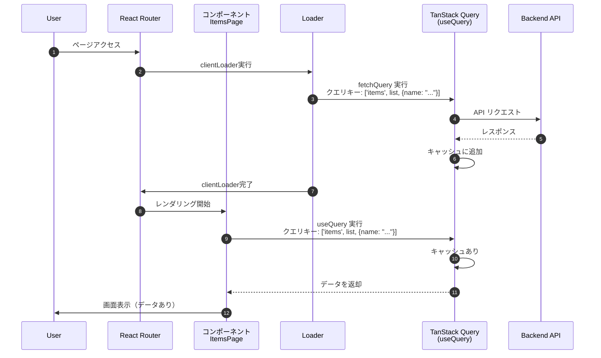

# 7. TanStack Query によるデータ管理

本章では、**TanStack Query (React Query)** を導入して、サーバー状態（Server State）の管理を効率化します。

## 7.1 TanStack Query とは

Webアプリケーションでのデータ取得には、いくつかの手法がありますが、それぞれに課題があります。

**1. useEffect / useState (Traditional)**
*   **ボイラープレート**: `isLoading`, `error` などの状態管理コードを毎回書く必要がある。
*   **キャッシュなし**: コンポーネントがマウントされるたびにリクエストが発生する。

**2. React Router loader / action (Framework Mode)**
*   **キャッシュ制御が弱い**: 基本的にページ遷移のたびに `loader` が再実行されるため、「戻る」ボタンでの遷移でも通信が発生してしまう。
*   **データの鮮度管理**: 「ウィンドウにフォーカスしたら再取得」「定期的にポーリング」といった機能は標準では持っていない。

TanStack Query は、これらの問題を解決するライブラリです。
強力なキャッシュ機能と宣言的なAPIにより、「サーバーからのデータ取得、キャッシュ、同期、更新」を驚くほど簡単に扱えるようになります。
React Router と組み合わせることで、**「初期表示はloaderで高速化し、その後のキャッシュ管理はTanStack Queryに任せる」** という理想的な構成が実現できます。

## 7.2 セットアップ

### 7.2.1 インストール

まずはパッケージをインストールします。

```bash
pnpm add @tanstack/react-query
```

### 7.2.2 QueryClient の設定

TanStack Query の設定とインスタンスを管理するファイルを作成します。ここでは、グローバルな設定（デフォルトのキャッシュ時間など）も定義します。

`queries`に設定した値は`useQuery`を利用したデータ取得に、`mutation`に設定した値は`useMutation`を利用したデータ更新の挙動に影響します。詳細は後続の章で解説します。  
また`staleTime` や `retry` など、設定可能な項目の詳細は **7.7章** で解説します。

**app/core/api/query-client.ts**

```typescript
import { QueryClient, type DefaultOptions } from '@tanstack/react-query';

export const queryConfig = {
  queries: {
    refetchOnWindowFocus: false,
    retry: false,
    staleTime: 1000 * 60,
  },
  mutations: {
    retry: false,
  },
} satisfies DefaultOptions;

export const queryClient = new QueryClient({ defaultOptions: queryConfig });
```

### 7.2.3 プロバイダーの適用

アプリ全体で TanStack Query を使えるように、`root.tsx` で `QueryClientProvider` を設定します。

**app/root.tsx**

```typescript
import { QueryClientProvider } from "@tanstack/react-query"; // 追加
import { queryClient } from "./core/api/query-client"; // 追加

export default function App() {
  return (
    <ThemeProvider theme={theme}>
      <QueryClientProvider client={queryClient}>
        <CssBaseline />
        <SampleLayout>
          <Outlet />
        </SampleLayout>
      </QueryClientProvider>
    </ThemeProvider>
  );
}
```

## 7.3 useQuery によるデータ取得と検索機能

商品一覧ページに「検索機能」を追加しながら、`useQuery` の使い方を学びます。

この章では下記ブランチを利用します。  
`ch7-3/useQuery`

### 7.3.1 useQuery によるデータ取得の基本概念

`useQuery` は、データの取得（Fetch）・キャッシュ・同期を管理するためのフックです。
これを利用することで、単にデータを取得するだけでなく、以下のような機能を利用できます。

*   **キャッシュの活用**: 一度取得したデータをメモリに保存し、不要なネットワーク通信を削減します。
*   **バックグラウンド更新**: キャッシュされた（古い）データを即座に表示しつつ、裏側で最新データを取得して画面を更新します（Stale-While-Revalidate）。
*   **自動リトライ**: 通信エラー発生時に、自動的に再試行します。

#### UI/UX へのメリット

これらの機能は、開発効率だけでなく、ユーザー体験（UX）の向上にも大きく寄与します。
具体的には、以下のような挙動を実現できます。

*   **キャッシュによる即時表示**:  
    一度取得したデータはメモリ上にキャッシュされるため、再度同じページにアクセスした際、ローディングを待機することなく即座にデータを表示できます。
*   **バックグラウンドでのデータ同期**:  
    キャッシュデータを表示しつつ、バックグラウンドでAPIリクエストを行い、データの鮮度を確認します。更新がある場合は自動的に画面に反映されるため、ユーザーは待ち時間を感じることなく最新の情報を得られます。

#### キャッシュとデータ再取得の仕組み

TanStack Query は、データが「新しい (fresh)」か「古い (stale)」かを常に管理しています。
この判定基準や再取得の挙動は、`QueryClient` でグローバルに設定することも、個別の `useQuery` で設定することも可能です。

*   **staleTime**: データが「古い」とみなされるまでの時間。この時間を過ぎると、次回のアクセス時にバックグラウンドで再取得が行われます。
*   **gcTime**: 使用されなくなったキャッシュがメモリから破棄されるまでの時間。

具体的なデータの流れは以下のシーケンス図のようになります。

- キャッシュがあり、fresh状態の場合、即座にキャッシュを返却する
- キャッシュがあり、stale状態の場合、即座にキャッシュを返却し、バックグラウンドでデータ再取得、キャッシュの更新、データ返却を行う
- キャッシュがない場合、データ取得、キャッシュの追加、データ返却を行う

::: mermaid
sequenceDiagram
  participant Component
  participant Hook as カスタムフック<br>(useItems)
  participant TQ as TanStack Query<br>(useQuery)
  participant API as Backend API

  Component->>Hook: カスタムフック実行
  Hook->>TQ: useQuery 実行
  TQ->>TQ: クエリキーでキャッシュ検索
  alt クエリキーに紐づくキャッシュあり
    TQ->>TQ: キャッシュのfresh/stale判定
    alt 実行結果がfresh状態の場合
      TQ-->>Hook: キャッシュを返却
      Hook-->>Component: キャッシュを表示
    else 実行がstale状態の場合
      TQ-->>Hook: キャッシュを返却
      Hook-->>Component: キャッシュを表示
      TQ->>API: バックグラウンドでAPI リクエスト
      API-->>TQ: レスポンス
      TQ->>TQ: キャッシュを更新
      TQ-->>Hook: 実行結果を返却
      Hook-->>Component: 実行結果を表示
    end
  else クエリキーに紐づくキャッシュなし
    TQ->>API: API リクエスト
    API-->>TQ: レスポンス
    TQ->>TQ: キャッシュに追加
    TQ-->>Component: 実行結果（データやエラー）を返却
  end
:::

### 7.3.2 モックサーバーの改修

それでは検索機能を開発していきます。
まず、検索クエリを受け取れるように `mock_server/server.js` を少し修正します。

**mock_server/server.js**

```javascript
// GET /items
app.get('/items', (req: Request, res: Response) => {
  // テスト用エラーコード
  // res.status(500).json();

  console.log('GET /items', req.query);
  const name = req.query.name as string | undefined;
  
  let result = items;
  if (name) {
    result = result.filter(item => item.name.includes(name));
  }
  
  res.json(result);
});
```

### 7.3.3 API関数の修正

`api.ts` の `getItems` を、検索キーワードを受け取れるように修正します。

**app/features/items/api.ts**

```typescript
// ... imports

export const getItems = async (name?: string) => {
  // params オプションでクエリパラメータを渡す
  return await api.get<Item[]>("/items", {
    params: { name },
  });
};
```

### 7.3.4 Query Options の定義

TanStack Query v5 から推奨されている `queryOptions` ヘルパーを使って、クエリの設定（キーと関数）を定義します。
これを定義しておくと、`useQuery` でも `fetchQuery`（後述）でも同じ設定を使い回せます。

まず、クエリキーを管理するファイルを個別に作成します。
これは、他の機能（例：商品作成後の商品一覧データキャッシュ無効化など）からも参照しやすくするためです。

**app/features/items/query-keys.ts**

```typescript
export const itemKeys = {
  all: ["items"] as const,
  list: (name?: string) => [...itemKeys.all, "list", { name }] as const,
  detail: (id: string) => [...itemKeys.all, "detail", id] as const,
};
```

次に、`api.ts` で `queryOptions` を定義します。

**app/features/items/api.ts** (追記)

```typescript
import { queryOptions } from "@tanstack/react-query";
import { itemKeys } from "./query-keys";

// ... existing code ...

export const getItemsQueryOptions = (name?: string) => {
  return queryOptions({
    queryKey: itemKeys.list(name),
    queryFn: () => getItems(name),
  });
};
```

### 7.3.5 データ取得の実装 (useItems)

コンポーネントから直接 `useQuery` を呼ぶのではなく、カスタムフック `useItems` を作成してデータ取得ロジックを分離します。

#### TanStack Query を利用したデータフェッチ

TanStack Query は、APIから取得したデータを「キー（Query Key）」と紐付けて管理します。
このキーは、`queryOptions` で設定した `queryKey` プロパティが使われます。

例えば、`['items', 'list', { name: 'watch' }]` というキーでデータを取得した場合、TanStack Query はこの配列全体を「ID」として扱い、取得した結果をメモリ上に保存（キャッシュ）します。
次回、同じキーでリクエストがあった場合、APIを叩く代わりに保存しておいたデータを即座に返却します。

キャッシュされるデータは単なるレスポンスの中身だけでなく、以下のようなメタ情報も含んだオブジェクトとして管理されます。

```typescript
// TanStack Queryにキャッシュされる実行結果オブジェクトのイメージ
{
  queryKey: ['items', 'list', { name: '...' }],
  state: {
    data: [...],                // APIから取得したデータ
    status: 'success',          // 'pending' | 'success' | 'error'
    error: null,                // エラーオブジェクト
    fetchedAt: 1732850000000,   // データ取得時間
    isStale: false,             // stale状態フラグ
    // ...省略...
  }
}
```

**app/features/items/hooks/useItems.ts**

```typescript
export function useItems() {
  // ...other code...

  const [searchName, setSearchName] = useState("");

  // useQuery 実行
  // 戻り値として、データ(data)や状態(status)を含む実行結果オブジェクトが返される
  const result = useQuery(getItemsQueryOptions(searchName));

  // 実行結果オブジェクトから必要なデータを取り出す
  const { data } = result;

  // ...other code...

  return {
    headerProps: {
      onRefresh: handleRefresh,
    },
    listProps: {
      items: data || [],
      onItemClick: handleItemClick,
    },
    searchProps: {
      onSearch: handleSearch,
    },
  };
}

```
**app/features/items/components/ItemSearch.tsx**
```ts
export function ItemSearch({ onSearch }: ItemSearchProps) {
  const handleSubmit = (event: FormEvent<HTMLFormElement>) => {
    event.preventDefault();
    const formData = new FormData(event.currentTarget);
    const name = formData.get("name") as string;
    onSearch(name);
  };

  return (
    <Box component="form" onSubmit={handleSubmit} sx={{ mb: 3, display: 'flex', gap: 1, maxWidth: 300 }}>
      <TextField
        name="name"
        label="商品名で検索"
        size="small"
        fullWidth
        placeholder="検索キーワードを入力"
        sx={{ bgcolor: "background.paper" }}
      />
      <Button type="submit" variant="contained">
        <SearchIcon />
      </Button>
    </Box>
  );
}

```

**app/features/items/pages/ItemsPage.tsx**
```typescript
import type { JSX } from "react";
import { ItemPageHeader } from "../components/ItemHeader";
import { ItemList } from "../components/ItemList";
import { useItems } from "../hooks/useItems";
import { ItemSearch } from "../components/ItemSearch";

export function ItemsPage(): JSX.Element {
  const { headerProps, listProps, searchProps } = useItems();
  return (
    <>
      <ItemPageHeader {...headerProps} />
      <ItemSearch {...searchProps} />
      <ItemList {...listProps} />
    </>
  );
}
```

#### 7.3.6 動作検証

ここまでの実装で、コンポーネントでのデータ取得に `useQuery` が使われるようになりました。
TanStack Query の強力なキャッシュ機能を体感するために、少し設定を変更して動作検証を行ってみましょう。

**1. 準備: clientLoader の一時無効化**

現在は `clientLoader` とコンポーネント内の `useQuery` の両方でデータ取得を行っているため、二重にリクエストが発生してしまっています。
検証を分かりやすくするため、`app/routes/items._index.tsx` の `clientLoader` を一時的にコメントアウトして無効化します。

```tsx
// app/routes/items._index.tsx

// export const clientLoader = useItemsRouteHandlers.clientLoader;
```

**2. 準備: モックサーバーの遅延設定**

「データ取得中」の状態を分かりやすくするため、モックサーバーのレスポンスを5秒遅らせます。
`mock_server/server.js` の `GET /items` に `setTimeout` を追加します。

```javascript
// mock_server/server.js
app.get('/items', (req, res) => {
  // ... (省略) ...
  if (name) {
    result = result.filter(item => item.name.includes(name));
  }
  
  // 5秒遅延させてレスポンスを返す
  setTimeout(() => {
    res.json(result);
  }, 5000);
});
```

**3. 準備: staleTime の短縮**

キャッシュがすぐに「古く（Stale）」なるように、`app/core/api/query-client.ts` の `staleTime` を一時的に **10秒** に変更します。

```typescript
// app/core/api/query-client.ts
staleTime: 1000 * 10, // 10秒
```

**4. 動作確認**

ブラウザの開発者ツール（Networkタブ）を開き、`Fetch/XHR` フィルタを有効にして確認します。

| テストケース | 操作 | 画面の挙動 | 解説 |
| :--- | :--- | :--- | :--- |
| **初回アクセス** | トップページから「商品一覧」へ移動 | 商品情報がない状態で画面が表示され、itemsリクエスト完了後に商品情報を表示 | キャッシュがないため、APIからデータを取得する。<br>※clientLoaderによる画面表示前のデータ取得を一時的にOFFにしているため、商品情報がない状態で画面が表示される。 |
| **Fresh状態** | 「戻る」でトップへ → **すぐに**「商品一覧」へ移動 | **一瞬で表示** | データ取得から10秒以内のため、キャッシュ（Fresh）が使われる。API通信は発生しない。 |
| **Stale状態** | **30秒ほど待ってから**、トップへ → 「商品一覧」へ移動 | **一瞬で表示**され、その後最新状態に更新 | キャッシュはあるが「古い(Stale)」ため、**古いキャッシュを一瞬で表示しつつ、バックグラウンドでAPIリクエスト**を実行<br>itemsリクエストが完了する前（Pending中）でも画面が表示されている点に注目 |

**検索機能での確認**

検索機能でも同様の挙動が確認できます。

1.  「イヤホン」で検索する → リクエスト発生（初回）
2.  一度検索ワードを消し、**すぐに**再度「イヤホン」で検索 → リクエストなし（Freshキャッシュ利用）
3.  **30秒待ってから**再度「イヤホン」で検索 → **一瞬で結果表示**され、裏でリクエスト発生（Staleキャッシュ利用 + バックグラウンド更新）

このように、TanStack Query を使うことで、**「ユーザーを待たせないUI」** と **「データの最新化」** を両立できていることが分かります。

確認ができたら、変更した設定（`clientLoader`, `server.js`, `query-client.ts`）を元に戻して次へ進みましょう。


## 7.4 clientLoader によるプリフェッチ (fetchQuery)

この章では下記ブランチを利用します。  
`ch7-4/fetchQuery`

### 7.4.1 現状の課題

現状の実装では、`clientLoader` と TanStack Query の `useQuery` の両方でデータ取得を行っています。
特に `clientLoader` では TanStack Query の機能を使わずにデータを取得しており、その結果は画面表示には使われていません。
これは無駄なデータ取得処理（二重リクエスト）が発生している状態です。

### 7.4.2 clientLoader を削除した場合の問題

この無駄をなくすために、単純に `clientLoader` を削除してしまうとどうなるでしょうか？
React Router の `clientLoader` には「画面レンダリング前にデータ取得を開始できる」という大きなメリットがあります。

もし `clientLoader` を削除して `useQuery` だけに頼ると、以下のような挙動になります。

1.  画面遷移（レンダリング）が開始される
2.  コンポーネントがマウントされ、`useQuery` が実行される
3.  データ取得が開始される（この間、データは `undefined`）
4.  データ取得完了後、再レンダリングされてデータが表示される

この場合、ユーザーから見ると一瞬「データがない状態」が表示されます。
それが「読み込み中」なのか「データが0件」なのかを区別するために、適切なローディング表示（スピナーなど）の実装が必須となります。

### 7.4.3 解決策: clientLoader で TanStack Query を利用する

そこで、`clientLoader` を削除するのではなく、**`clientLoader` 内で TanStack Query を使ったデータ取得を行う** ように修正します。

ただし、`clientLoader` は React コンポーネントではないため、フックである `useQuery` は利用できません。
代わりに、`queryClient.fetchQuery` メソッドを使用します。

`fetchQuery` は、指定したクエリキーに紐づくキャッシュが存在しない、またはデータが古い（Stale）場合のみデータ取得を行います。

これを利用して、以下の流れを作ります。

1.  `clientLoader` で `fetchQuery` を実行し、事前にデータをキャッシュに溜める。
2.  画面レンダリング時には既にキャッシュがある状態にする。
3.  コンポーネントの `useQuery` は、そのキャッシュを即座に読み取って表示する。

これにより、コンポーネント側では「データ取得待ち」の状態がほとんど発生しなくなるため、ローディング表示の考慮を大幅に減らすことができます。

具体的な処理の流れは以下のようになります。



### 7.4.4 実装例

**1. API定義とQuery Options**

※7.3.4 で実装済みのため、変更はありません。

```typescript
import { api } from "~/core/api/api-client";
import { queryOptions } from "@tanstack/react-query";
import type { Item } from "./types";

// ... itemKeys ...

export const getItems = async (name?: string) => {
  return await api.get<Item[]>("/items", {
    params: { name },
  });
};

export const getItemsQueryOptions = (name?: string) => {
  return queryOptions({
    queryKey: itemKeys.list(name),
    queryFn: () => getItems(name),
  });
};
```

**2. clientLoaderの実装**

`app/features/items/hooks/useItemsRoute.ts`

```typescript
import { queryClient } from "~/lib/query-client";
import { getItemsQueryOptions } from "../api";

export const useItemsRouteHandlers = {
  clientLoader: async () => {
    // 画面初期表示時点のクエリキー（name=""）と同じクエリキーでfetchQueryを実行する
    // これにより、初期表示時のデータ取得を待機できる
    await queryClient.fetchQuery(
      getItemsQueryOptions()
    );
    
    return null;
  },
};
```

**3. コンポーネントでの利用**

※7.3.5 で実装済みのため、変更はありません。

```typescript
import { useSearchParams } from "react-router";
import { useQuery } from "@tanstack/react-query";
import { getItemsQueryOptions } from "../api";
import { Box, Alert } from "@mui/material";
// ... imports

export function ItemsPage() {
  const [searchParams, setSearchParams] = useSearchParams();
  const name = searchParams.get("name") || "";

  // キャッシュがあれば即座にデータが返る
  // エラー時は throwOnError により ErrorBoundary が表示される
  const { data: items } = useQuery(
    getItemsQueryOptions(name)
  );

  // ... render
}
```

### 7.4.5 動作確認

`clientLoader` によるプリフェッチの効果を確認します。
違いを明確にするため、モックサーバーの遅延（5秒）が有効な状態で確認することをお勧めします（7.3.6の手順参照）。

**1. clientLoader 有効時（プリフェッチあり）**

現在の実装（`fetchQuery` あり）で動作を確認します。

1.  トップページから「商品一覧」をクリックします。
2.  **画面遷移自体が待機**されます（データ取得完了まで前のページに残る）。
3.  画面が切り替わった瞬間、**すぐに商品データが表示されます**。
    *   ユーザーは「データ読み込み中の空のリスト」を見ることなく、データが揃った状態でページを閲覧できます。

**2. clientLoader 無効時（プリフェッチなし）**

比較のために、`clientLoader` の処理を一時的に無効化してみましょう。
`app/features/items/hooks/useItemsRoute.ts` を修正します。

```typescript
// app/features/items/hooks/useItemsRoute.ts

export const useItemsRouteHandlers = {
  clientLoader: async () => {
    // await queryClient.fetchQuery(...) // コメントアウトして無効化
    return null;
  },
};
```

1.  トップページから「商品一覧」をクリックします。
2.  **即座に画面遷移**します。
3.  画面遷移直後は**商品データが表示されていません**。
4.  少し時間（遅延設定分）が経過した後、データが表示されます。

**まとめ**

`clientLoader` で `fetchQuery` を使うことで、「データ取得完了まで画面遷移を待つ」という挙動になります。
これにより、ユーザー体験の向上（ガタつきのない表示）などが期待できます。


## 7.5 useMutation によるデータ更新

この章では下記ブランチを利用します。  
`ch7-5/useMutation`

### 7.5.1 useMutation によるデータ更新の基本概念

#### TanStack Query を利用したデータ更新

TanStack Query によるデータ更新では、データフェッチと同様の実行結果オブジェクト（data、error、status など）に加えて、実行関数を取得できます。

実行関数（`mutate` または `mutateAsync`）を呼び出すと API リクエストが送信され、その処理状況や結果に応じて、実行結果オブジェクト（`status`, `data`, `error` 等）がリアクティブに更新されます。

```typescript
// TanStack Query の Mutation で管理される実行結果オブジェクトのイメージ
{
  state: {
    status: 'idle',               // 'idle' | 'pending' | 'success' | 'error'
    data: undefined,              // 成功時のレスポンスデータ
    error: null,                  // エラーオブジェクト（ApiValidationErrorなど）
    variables: undefined,         // mutate実行時に渡した引数
    submittedAt: 0,               // mutate実行時刻
    // ...省略...
  },
  // 実行関数
  mutate: (variables) => void,           // 同期的な実行関数
  mutateAsync: (variables) => Promise<TData>,  // 非同期的な実行関数
}
```

### 7.5.2 clientAction との併用について

React Router の `clientAction` はフォーム送信をベースにした強力な機能ですが、TanStack Query の `useMutation` とは役割が競合するため、基本的には併用せずどちらか一方を選択します。

本プロジェクトでは、以下の理由から `useMutation` を採用します。

1.  **状態管理の容易さ**: `isPending` (ローディング中)、`isError` (エラー発生)、`isSuccess` (成功) などの状態をフックから直接取得でき、UIへの反映が簡単です。
2.  **柔軟な制御**: `onSuccess` や `onError` コールバックを使って、トースト表示や画面遷移、キャッシュの無効化などを直感的に記述できます。
3.  **一貫性**: データ取得(`useQuery`)と同じライブラリで統一することで、キャッシュ管理(`invalidateQueries`)などがスムーズに行えます。

### 7.5.3 実装例

**カスタムフック: app/features/items/hooks/useItemCreate.ts**

```typescript
export function useItemCreate() {
  const navigate = useNavigate();
  const queryClient = useQueryClient();

  // useMutation 実行
  // 戻り値として、データ(data)や状態(status)を含む実行結果オブジェクトや、実行関数が返される
  const mutation = useMutation({
    mutationFn: (newItem: CreateItemParams) => createItem(newItem),
    onSuccess: () => {
      queryClient.invalidateQueries({ queryKey: itemKeys.all });
      navigate("/items");
    },
    // throwOnError=trueの場合、エラー時にErrorBoundaryに投げる
    throwOnError: (error) => {
      // 400エラー（バリデーションエラー）以外はErrorBoundaryに投げる
      if (isAxiosError(error) && error.response?.status === 400) {
        return false;
      }
      return true;
    },
  });

  // 実行結果オブジェクトから必要なデータと非同期実行関数を取り出す
  const { mutateAsync, isPending, error } = mutation;

  return {
    mutateAsync,
    isSubmitting: isPending,
    errorMessage: error?.toString(),
  };
}
```

**コンポーネント: app/features/items/pages/ItemCreatePage.tsx**

```typescript
import { useItemCreate } from "../hooks/useItemCreate";
import { Box, Button, TextField, Alert, Paper, Typography } from "@mui/material";
import type { CreateItemParams } from "../types";

export function ItemCreatePage() {
  const { mutateAsync, isSubmitting, errorMessage } = useItemCreate();
  
  const handleSubmit = async (event: React.FormEvent<HTMLFormElement>) => {
    event.preventDefault();
    const formData = new FormData(event.currentTarget);
    
    const newItem: CreateItemParams = {
      name: formData.get("name") as string,
      price: Number(formData.get("price")),
      description: formData.get("description") as string,
    };

    await mutateAsync(newItem);
  };

  return (
    <Paper sx={{ p: 4, maxWidth: 600, mx: "auto", mt: 4 }}>
      <Typography variant="h5" component="h1" gutterBottom sx={{ mb: 3 }}>
        商品作成
      </Typography>
      
      {/* エラーメッセージの表示 */}
      {errorMessage && (
        <Alert severity="error" sx={{ mb: 2 }}>
          {errorMessage}
        </Alert>
      )}

      <Box component="form" onSubmit={handleSubmit} noValidate sx={{ display: "flex", flexDirection: "column", gap: 3 }}>
        <TextField
          name="name"
          label="商品名"
          required
          fullWidth
          disabled={isSubmitting}
        />
        <TextField
          name="price"
          label="価格"
          type="number"
          required
          fullWidth
          disabled={isSubmitting}
        />
        <TextField
          name="description"
          label="商品説明"
          multiline
          rows={4}
          fullWidth
          disabled={isSubmitting}
        />
        
        <Box sx={{ display: "flex", justifyContent: "flex-end", gap: 2, mt: 2 }}>
          <Button
            variant="outlined"
            href="/items"
            disabled={isSubmitting}
          >
            キャンセル
          </Button>
          <Button 
            type="submit" 
            variant="contained" 
            disabled={isSubmitting}
          >
            {isSubmitting ? "登録中..." : "登録"}
          </Button>
        </Box>
      </Box>
    </Paper>
  );
}
```

### 7.5.4 データ更新フロー

以下のシーケンスは、データ更新後に `invalidateQueries` でキャッシュを無効化する動作を示します。

データ更新処理（Mutation）が成功した際は、`invalidateQueries` を使用して関連するキャッシュを無効化します。
これにより、対象のキャッシュは `stale`（期限切れ）状態となり、次回そのデータが必要になったタイミング（画面遷移やフォーカス時など）で自動的に API 再取得が行われます。

例えば、ユーザー作成後に「ユーザー一覧」のクエリキーを無効化しておけば、一覧画面に戻った際に最新のデータ（追加されたユーザーを含む）が再取得され、画面の整合性が保たれます。

::: mermaid
sequenceDiagram
participant Component as コンポーネント<br>ItemCreatePage
participant Hook as カスタムフック<br>useItemCreate
participant TQ as TanStack Query<br>useMutation
participant API as Backend API

Component->>Hook: データ更新を要求
Hook->>TQ: mutate 実行
TQ->>API: API リクエスト（POST/PUT/DELETE）
API-->>TQ: レスポンス
TQ-->>Hook: 実行結果を返却
Hook-->>Component: 実行結果（データやエラー）を表示
TQ->>TQ: invalidateQueriesで<br>キャッシュをstale状態に更新
:::

このように、TanStack Query を使うことで、データの取得から更新、キャッシュの同期までを一貫したフローで管理できるようになります。


## 7.6 その他の便利機能

TanStack Query には、開発者体験とユーザー体験を向上させる多くの機能が備わっています。
ここでは、特によく利用される機能をいくつか紹介します。

この章では下記ブランチを利用します。  
`ch7-5/useMutation`

### 7.6.1 ウィンドウフォーカス時の再取得 (refetchOnWindowFocus)

ユーザーが別のタブやウィンドウを見てから、再びアプリケーションのタブに戻ってきた際に、自動的にデータを再取得（バックグラウンド更新）する機能です。
これにより、ユーザーは「更新ボタン」を押さなくても、常に最新の情報を目にすることができます。

**実装方法**

`queryOptions` または `useQuery` のオプションで設定します。
デフォルトでは `true`（有効）になっています。

```typescript
export const getItemsQueryOptions = () => {
  return queryOptions({
    queryKey: itemKeys.all,
    queryFn: getItems,
    // true: 有効 (デフォルト), false: 無効, 'always': 常に再取得
    refetchOnWindowFocus: true, 
  });
};
```

**UIへの影響**

*   ユーザーがタブを切り替えて戻ってくると、画面上のデータが自動的に最新化されます。
*   再取得中もキャッシュが表示され続けるため、ユーザーは読み込み待ちを感じません（Stale-While-Revalidate）。

**検証方法**

1.  アプリをブラウザで開き、商品一覧を表示します。
2.  別のタブを開き、数秒間そのタブを表示します。
3.  その間に、データベース（モックサーバーの `server.js`）のデータを直接書き換えるか、別のウィンドウで商品を更新します。
4.  アプリのタブに戻ります。
5.  自動的にネットワークリクエストが走り、画面のデータが更新されることを確認します。

### 7.6.2 ポーリング (refetchInterval)

一定間隔で自動的にデータを再取得する機能です。
リアルタイム性が求められるダッシュボードや、ステータス監視画面などで有用です。

**実装方法**

ミリ秒単位で間隔を指定します。

```typescript
export const getDashboardQueryOptions = () => {
  return queryOptions({
    queryKey: ['dashboard'],
    queryFn: getDashboardData,
    // 5秒ごとに再取得
    refetchInterval: 5000,
  });
};
```

**UIへの影響**

*   指定した間隔でデータが更新されます。
*   ユーザーが操作していなくても、画面上の数値やグラフが最新の状態に保たれます。

**検証方法**

1.  `refetchInterval` を設定したページを開きます。
2.  開発者ツールの Network タブを開きます。
3.  指定した間隔（例：5秒）ごとに、自動的に API リクエストが発生していることを確認します。

### 7.6.3 依存クエリ (enabled)

「あるデータが取得できてから、次のデータを取得したい」といった依存関係や、「検索条件が入力されるまではリクエストを送りたくない」といった制御を実現します。
`enabled` オプションに `false` を渡すとクエリが無効化され、`true` になると自動的に実行されます。

**実装方法**

例えば、「検索キーワードが入力されている場合のみ検索APIを実行する」ケースです。

```typescript
const [name, setName] = useState("");

const { data: items } = useQuery({
  queryKey: ['items', name],
  queryFn: () => getItems(name),
  // name が空文字の場合は実行しない
  enabled: !!name, 
});
```

**UIへの影響**

*   初期表示時や入力が空の時に、無駄な全件取得リクエストを防げます。
*   ユーザーが検索ボタンを押すまで（あるいは入力するまで）データ取得を待機させることができます。

**検証方法**

1.  検索フォームが空の状態でページを開きます。
2.  Network タブで、APIリクエストが飛んでいないことを確認します。
3.  検索フォームに文字を入力します。
4.  その瞬間にリクエストが発生し、データが表示されることを確認します。

### 7.6.4 データの加工 (select)

API から取得したデータを、コンポーネントで使いやすい形に加工・フィルタリングしてから返却します。
この加工処理はメモ化されるため、データが変わらない限り再計算されず、パフォーマンスにも優れています。

**実装方法**

`select` オプションに関数を渡します。

```typescript
const { data: expensiveItems } = useQuery({
  queryKey: ['items'],
  queryFn: getItems,
  // 価格が1万円以上の商品だけを抽出して返す
  select: (data) => data.filter(item => item.price >= 10000),
});
```

**UIへの影響**

*   コンポーネント側で `filter` や `map` を書く必要がなくなり、ロジックがシンプルになります。
*   必要なデータだけを受け取れるため、レンダリングの最適化に繋がります。

**検証方法**

1.  `select` を実装したコンポーネントを表示します。
2.  API のレスポンス（全量データ）と、コンポーネントで受け取ったデータ（加工後）を `console.log` などで比較します。
3.  意図した通りにフィルタリングや変換が行われていることを確認します。

## 7.7 まとめ

本章では、TanStack Query を導入して、サーバー状態管理を効率化する方法を学びました。

*   **useQuery**: データの取得、キャッシュ、自動更新を管理します。`staleTime` や `gcTime` を理解することで、適切なキャッシュ戦略を立てることができます。
*   **useMutation**: データの作成・更新・削除を管理します。`onSuccess` で `invalidateQueries` を呼び出すことで、更新後に自動的にデータを最新化するフローを作ることができます。

TanStack Query を使うことで、「ローディング状態の管理」「エラーハンドリング」「データの同期」といった複雑な処理を、宣言的（「どのように取得するか」という手順ではなく、「どのようなデータが欲しいか」という状態を定義するスタイル）かつシンプルに記述できるようになりました。
